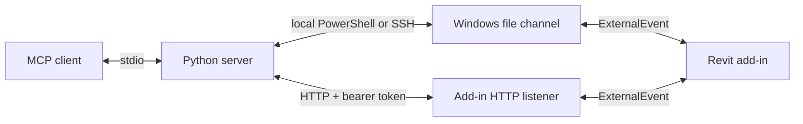

<picture>
  <source media="(prefers-color-scheme: dark)" srcset="docs/screenshots/revit-model-mcp_hero_dark.png">
  
</picture>

 [](https://github.com/sharafutdinovdi/revit-model-mcp/actions/workflows/ci.yml)   [](LICENSE)

## What it does

The server gives MCP clients read access to a live Autodesk Revit model by default.
Tools inspect elements, views, parameters and warnings.
Selected views can be exported to PNG for visual review.

## Why

Model inspection combines quantities and geometry.
An MCP client can discover model categories, aggregate element data and inspect selected views through the same connection.
The add-in handles Revit API access inside Revit.
The Python server can run on Windows or connect from another machine through HTTP or SSH.

## In action

The session above ran from a Mac against Revit 2023 on a Windows workstation over SSH: `revit_document_info`, then room areas grouped by level, then `revit_export_view`. The export is the file the last call saved, untouched:

<picture>
  <source media="(prefers-color-scheme: dark)" srcset="docs/screenshots/revit-model-mcp_export-view_dark.png">
  
</picture>

## Quick start

This checkout is unreleased.
The add-in requires Windows and Revit 2022-2026.
The server requires Python 3.11 or later and uv.

On Windows, build from the repository root and install the Revit 2026 output:

```powershell
dotnet build src/RevitModelMcp.Addin -c Release.R26 -p:DeployAddin=false
if ($LASTEXITCODE -ne 0) { throw 'Build failed.' }
$addins = Join-Path $env:APPDATA 'Autodesk\Revit\Addins\2026'
$install = Join-Path $addins 'RevitModelMcp'
New-Item -ItemType Directory -Force -Path $install | Out-Null
Copy-Item 'src\RevitModelMcp.Addin\bin\Release.R26\*' $install -Recurse -Force
[xml]$manifest = Get-Content 'src\RevitModelMcp.Addin\RevitModelMcp.addin'
$manifest.SelectSingleNode('/RevitAddIns/AddIn/Assembly').InnerText = [string](Join-Path $install 'RevitModelMcp.dll')
$manifest.Save((Join-Path $addins 'RevitModelMcp.addin'))
```

`DeployAddin=false` disables automatic deployment during the build.
The install uses only `RevitModelMcp\` and `RevitModelMcp.addin` under the Revit 2026 add-ins directory.
For another installed Revit year, change both `Release.R26` paths and the add-ins year.
Start Revit and open a model after installation, or restart it if it was already running.
The add-in creates `%LOCALAPPDATA%\RevitModelMcp\instance_<processId>.json` and updates it every five seconds.
It adds no ribbon tab or button.

Register the server with Claude Code on that Windows machine:

```powershell
claude mcp add revit-model-mcp -e REVIT_MCP_HOST=local -e REVIT_MCP_REDACT_PATHS=1 -- uv run --directory C:/Projects/revit-model-mcp/server revit-model-mcp
```

For a remote client, HTTP needs no SSH server on the workstation.
The add-in creates `%LOCALAPPDATA%\RevitModelMcp\settings.json` with a generated bearer token and a loopback listener at port 53110.
Supply that token as `REVIT_MCP_TOKEN` through the client's secret store.
With an existing SSH route, keep the workstation bind on loopback:

```sh
ssh -N -L 53110:127.0.0.1:53110 user@host
```

In another terminal:

```sh
export REVIT_MCP_HOST=http://127.0.0.1:53110
uv run --directory server revit-model-mcp
```

The [remote setup commands](docs/transport.md#remote-setups) cover direct LAN, Tailscale, SSH forwarding and the legacy file channel.
Direct LAN uses `REVIT_MCP_HOST=http://192.168.1.69:53110` plus explicit `0.0.0.0` binding, URL ACL and firewall setup.
Tailscale uses `http://<tailscale-ip>:53110` with the listener bound to that interface.
For a corporate PC without admin rights, use provisioned Tailscale or an existing SSH tunnel; never expose the port on the office LAN.

For the legacy file channel from macOS or Linux with an existing Windows SSH alias:

```sh
claude mcp add revit-model-mcp -e REVIT_MCP_HOST=ssh:revit-host -e REVIT_MCP_REDACT_PATHS=1 -- uv run --directory /absolute/path/to/revit-model-mcp/server revit-model-mcp
```

Replace the checkout path and `revit-host` alias with the client's values.
The SSH account must be the Windows account running Revit.
`uv run --directory server revit-model-mcp --help` prints environment transport settings without opening a connection.
See [server setup](server/README.md) for channel overrides and SSH multiplexing.

Ask the MCP client to call `revit_ping`.
The expected successful response has `command: "ping"` and `success: true`.
Then call `revit_document_info` to inspect the active model.
Supply `document` when multiple Revit instances are running.

## How it works



The server submits jobs over HTTP or writes them to the Windows file channel.
The add-in processes both through the same ExternalEvent and accepts one job at a time.
HTTP returns JSON and PNG directly; local and SSH modes keep their file-based responses.
A heartbeat identifies each Revit instance and its active document.
The public tools read model data and export images without editing model elements.
See [architecture](docs/architecture.md) and [transport](docs/transport.md).

## Tools

All tools support local, SSH and HTTP transports.
`revit_export_view` downloads PNG through `/views/{name}/image` in HTTP mode.
`revit_list_instances` reports the connected Revit process in HTTP mode.

<!-- Generated from decorated tool functions in server/revit_model_mcp/server.py. -->

| Tool | Purpose |
|---|---|
| `revit_ping` | Check the RevitModelMcp connection without reading the model. |
| `revit_document_info` | Read general information about the active Revit model. |
| `revit_list_catalog` | Discover valid model names before filtering. |
| `revit_aggregate_elements` | Read a compact element summary after revit_list_catalog. |
| `revit_query_elements` | Read a page of elements after revit_list_catalog. |
| `revit_list_views` | Find views in the active model before analyzing a view. |
| `revit_view_summary` | Read element categories and counts for a selected view. |
| `revit_export_view` | Export a selected view to PNG when numbers do not explain geometry. |
| `revit_view_elements` | Read one page of elements in a selected view. |
| `revit_element_details` | Read parameters and geometry of an element by Revit id. |
| `revit_view_warnings` | Read Revit warnings related to elements in a selected view. |
| `revit_list_warnings` | Group model warnings by text. |
| `revit_list_relations` | Read model object membership or dependencies. |
| `revit_list_instances` | List Revit processes with active documents, versions and processId. |

`revit_element_details` returns geometry alongside parameters in `data`.
`revit_query_elements(include_geometry=True)` adds the same fields to each element in the returned page.
The query flag defaults to `False`; default queries omit geometry.
All coordinates use model axes in millimetres rounded to one decimal place.

| Field | Contents |
|---|---|
| `location` | Point: `type:"point"`, `xMm`, `yMm`, `zMm`. Curve: `type:"curve"`, `startMm`, `endMm`, `lengthMm`. |
| `boundingBox` | `minMm`, `maxMm`, `centerMm` as `[x,y,z]` arrays from the element's model bounding box. Rooms use their own bounding box. |
| `roomCenterMm` | `[x,y,z]` from a placed room's location. Use `roomCenterMm` when placing something inside a room. A bounding box centre may lie outside a nonrectangular room. |

Unavailable geometry is omitted.

## Actions (opt-in)

Read-only by default. Actions are a separate tool set you enable on purpose.

| Tool | Action |
|---|---|
| `revit_select` | Select element IDs, or clear selection with an empty list. |
| `revit_show` | Open a suitable view when needed, show elements and optionally select them; return `activeView` and `viewOpened`. |
| `revit_isolate` | Temporarily isolate elements in the active view; `reset=true` clears temporary hide/isolate. |
| `revit_move` | Move elements by model-axis offsets in millimetres. |
| `revit_place_family` | Place a loaded family name or `Family: Type`, case-insensitively, at model XY in millimetres on a named level; rotate about Z in degrees. |
| `revit_create_wall` | Create a straight wall between XY endpoints in millimetres on a named level. |
| `revit_set_parameter` | Set an instance parameter by name, falling back to the type; lengths use mm and areas use m2. |
| `revit_delete` | Delete elements; the removed count includes dependent elements deleted by Revit. |

`revit_show` checks the open UI views before calling `ShowElements`.
If none contains a requested element, it opens a non-template plan for an element's level.
Floor plans take priority, followed by names starting with the level name.
Without a matching plan it uses the first non-template 3D view.
The handler sets `UIDocument.ActiveView` synchronously inside its ExternalEvent without a transaction; `ShowElements` needs the view active immediately.
`RequestViewChange` defers the change until control returns to Revit.
The response includes `activeView` and `viewOpened`, which reports whether the handler opened a previously closed view.

Every action suppresses TaskDialog prompts with OK, or Yes if OK is unavailable, and returns their messages in `dialogsSuppressed`.
The dialog handler is removed in `finally`, including on errors.
Missing families return up to five similar names with their family categories in `closestFamilies`; unrelated names are omitted.
For `Family: Type`, `type_name=null` uses the embedded type; a conflicting `type_name` is rejected.
For a family name alone, `type_name=null` selects the first loaded type.

Both gates must be enabled:

1. Set `REVIT_MCP_ALLOW_WRITE=1` in the Python server process environment and restart the server.
   With any other value or no value, MCP `list_tools` does not include the action tools.
2. Create `%LOCALAPPDATA%\RevitModelMcp\allow-write` on the Revit workstation:

   ```powershell
   New-Item -ItemType Directory -Force "$env:LOCALAPPDATA\RevitModelMcp" | Out-Null
   New-Item -ItemType File -Force "$env:LOCALAPPDATA\RevitModelMcp\allow-write" | Out-Null
   ```

The add-in checks the gate file for every action, including selection and navigation.
Without it, the response contains `success:false` and `error:"actions disabled on the workstation"`.
Removing the file disables actions immediately; restarting Revit is unnecessary.
The gate stays in the default local application data directory even if the transport uses `REVIT_MCP_CHANNEL_DIR`.

Actions require exactly one running Revit instance and address its process ID.
Coordinates use model axes and the named level's project elevation.
Pass `null` for `type_name` to choose the family's first type, or for `wall_type` to choose the first basic wall type.
Family placement uses the level-based, nonstructural overload; hosted, face-based and adaptive families may require another placement API and return an error.
An unloaded family returns up to five closest loaded names.
Parameter values use invariant numeric notation; other Double parameters use Revit internal units.
Type parameter edits affect all instances of that type and return `parameterScope:"type"`.
ElementId and read-only parameters cannot be set.

Every action response includes the active view name in `activeView`, including workstation errors.
Model changes and temporary isolation use one transaction named after the tool.
Revit failure messages, including warnings at commit, cause rollback and return their text.
Selection and navigation use UI calls without model transactions.
The tools do not save the model.
After a timeout, inspect the model before retrying an action; the previous call may have executed.

## Security

The model API is read-only by default.
Action tools are absent unless `REVIT_MCP_ALLOW_WRITE=1`; action execution also requires the workstation gate file described above.
The default surface covers ping, document and instance information, catalogs, element queries and aggregates, views and their elements, element parameters, warnings, relations and PNG view export.
The [command executor](src/RevitModelMcp.Addin/Control/ReadCommandExecutor.cs) and readers open no Revit transactions and expose no element creation, deletion, parameter setters or model save operations.
View export calls `Document.ExportImage` and writes an image file.
Channel jobs, responses, heartbeats and diagnostic logs also write files outside the model.

`REVIT_MCP_REDACT_PATHS=1` or `--redact-paths` reduces response `documentPath` fields to file names.
This covers nested results and instance listings.
Model names, parameter values, error text, channel files and exported image `localPath` values remain visible.

HTTP binds to `127.0.0.1:53110` by default.
A per-machine 32-byte random bearer token is generated in `settings.json`; its protected NTFS ACL grants access only to the current user.
The token is never logged.
All HTTP routes except `/health` require it; health exposes the active document name and process information.
There is no built-in TLS: put remote access behind a tunnel or a TLS proxy.
Set `REVIT_MCP_HTTP_ENABLED=0` in Revit's environment or `httpEnabled=false` in settings to disable the listener entirely.
Actions require both gates over every transport.

SSH mode stores no credentials.
Authentication and routing use the local OpenSSH configuration and agent.
The default multiplexing socket directory has mode `0700` on macOS and Linux.
The Windows file channel relies on the account's filesystem permissions.
See [transport](docs/transport.md) and [security reporting](SECURITY.md).

## Testing

The Python tests cover job construction, transport failures, downloads, action validation and MCP stdio registration with both flag states.
A threaded fake HTTP server covers health, authentication, busy responses, job polling and PNG download.
Core tests cover parsing, serialization, formatting, units and query processing.
These tests do not require a live Revit model.

On Windows:

```powershell
dotnet build src/RevitModelMcp.Addin -c Release.R26 -p:DeployAddin=false
dotnet build src/RevitModelMcp.Addin -c Release.R22 -p:DeployAddin=false
dotnet test --project tests/RevitModelMcp.Core.Tests/RevitModelMcp.Core.Tests.csproj
```

On the MCP client:

```sh
cd server
uv run --with pytest pytest -q
```

The CI workflow builds the add-in for Revit 2022 and 2026 on `windows-latest`, runs the core tests and the server tests on every push: [latest run](https://github.com/sharafutdinovdi/revit-model-mcp/actions/workflows/ci.yml). First run on 2026-09-11: both builds succeeded, core tests passed, 55 server tests passed.

## Compatibility

| Component | Configured support |
|---|---|
| Revit add-in | Revit 2022-2026 on Windows |
| Add-in configurations | `Debug.R22` through `Debug.R26`, `Release.R22` through `Release.R26` |
| .NET targets | .NET Framework 4.8 for Revit 2022-2024, .NET 8 for Revit 2025-2026 |
| Build SDK | Selected by `global.json` |
| Python server | Python 3.11+, MCP Python SDK 2+ |
| Local transport | Windows PowerShell under the Revit user's account |
| HTTP transport | Standard-library HTTP/HTTPS client; Windows HttpListener on .NET 4.8 and 8 |
| SSH transport | SSH client on Windows, macOS or Linux; Windows SSH host with PowerShell |

The CI workflow targets Revit 2022 and 2026 builds on Windows.
Live model validation and release packaging are pending.

## Author and license

Author and maintainer: Dinar Sharafutdinov.
Licensed under [MIT](LICENSE).
See [third-party notices](THIRD-PARTY-NOTICES.md) for dependency licenses.
