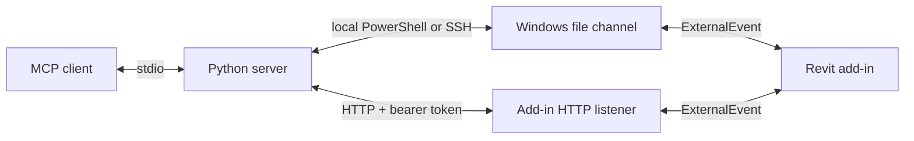

# Revit Model MCP

An MCP server that lets an AI agent read a live Autodesk Revit model and, when you allow it, act in it.

 [](https://github.com/sharafutdinovdi/revit-model-mcp/actions/workflows/ci.yml) [](https://github.com/sharafutdinovdi/revit-model-mcp/releases)  [](LICENSE) [](https://github.com/sharafutdinovdi/revit-model-mcp/actions/workflows/codeql.yml)

## What it does

The server reads a live Autodesk Revit model by default: elements, views, parameters, warnings, PNG view exports and coordinator checks for model health, links, shared coordinates and parameter fill.
Model-changing actions return a `verification` block and accept `dry_run` for previews that roll back.
Actions are opt-in and require two gates: `REVIT_MCP_ALLOW_WRITE=1` in the server and an `allow-write` file on the Revit workstation.
The client can run locally or reach a remote Windows workstation over LAN, Tailscale or an SSH tunnel using HTTP with a bearer token.

## Why

Model review needs quantities and geometry.
An MCP client can discover categories, aggregate element data and export views through one connection.
The add-in handles API access inside Revit while the Python server runs on the client's machine.

## In action

Claude Desktop runs on a Mac and connects to Revit 2026 on a Windows workstation.
Both action gates are enabled in this recording.


What happens in the recording, in order:

1. "What model is open in Revit right now?" The client reads the document, levels and room counts.
2. "Which level has the most room area? Find the largest room and show it to me." The client aggregates room areas by level and queries the largest room.
   `revit_show` opens a matching plan and selects the room.
3. "Isolate that room, place a Chair-Breuer at its centre and move it 800 mm along X." `revit_isolate`, then `revit_place_family` at the room's `roomCenterMm`, then `revit_move`. Each mutation is its own Revit transaction.
4. Cleanup afterwards is one more sentence: reset the view, delete the chair.

The picture below is the PNG saved by `revit_export_view` during an earlier session against Revit 2023 over SSH, untouched:

<picture>
  <source media="(prefers-color-scheme: dark)" srcset="docs/screenshots/revit-model-mcp_export-view_dark.png">
  
</picture>

## Quick start

The add-in requires Windows and Revit 2022-2027.
Build with the .NET SDK selected by [`global.json`](global.json).
The server requires Python 3.11 or later, [uv](https://docs.astral.sh/uv/getting-started/installation/) and an MCP client.
Clone on each machine that will build or run a component:

```sh
git clone https://github.com/sharafutdinovdi/revit-model-mcp.git
cd revit-model-mcp
```

The commands below start from the repository root.
For a downloaded script, use `Unblock-File .\install.ps1` to remove its downloaded-file block or `Set-ExecutionPolicy -Scope Process Bypass` for the current PowerShell session.
On Windows, close Revit and build and install for Revit 2026:

```powershell
.\install.ps1 -Year 2026 -Source Build
```

Or install the latest GitHub release for every detected Revit year (2022-2027):

```powershell
.\install.ps1 -Source Release
```

The inline build, copy and manifest-patching commands live in [`install.ps1`](install.ps1).
Installation uses `RevitModelMcp\` and `RevitModelMcp.addin` under `%APPDATA%\Autodesk\Revit\Addins\<year>`.
Use `-Year 2024,2026` to select years and `-Version 0.2.0` to pin a release.
`-Source Release` requires a release with an asset for each requested year: v0.1.0 ships R22–R26; v0.2.0 adds R27.
Add `-SignThumbprint <thumbprint>` to sign installed DLLs with a local code-signing certificate on workstations where Revit shows the unsigned add-in dialog on every rebuild.
Add `-RegisterClaude` to register the local server with Claude Code; both `claude` and `uv` must be on PATH.
Use `-Uninstall -Year 2026` to remove that year's add-in; local settings remain intact.
The script refuses to run while Revit is open unless `-Force` is supplied.
Start Revit and open a model after installation, or restart it if it was already running.
The add-in creates `%LOCALAPPDATA%\RevitModelMcp\instance_<processId>.json` and updates it every five seconds.
It adds no ribbon tab or button.

Register the server with Claude Code on that Windows machine:

```powershell
$server = (Resolve-Path ./server).Path
claude mcp add revit-model-mcp -e REVIT_MCP_HOST=local -e REVIT_MCP_REDACT_PATHS=1 -- uv run --directory "$server" revit-model-mcp
```

For remote clients, use the setup in [Transports and remote workstations](#transports-and-remote-workstations).
`uv run --directory server revit-model-mcp --help` checks package startup and prints configuration without contacting Revit.

Ask the MCP client to call `revit_ping`.
The expected successful response has `command: "ping"` and `success: true`.
Then call `revit_document_info` to inspect the active model.
For file transports, supply a distinctive `document` title when multiple Revit instances are running.

## How it works



The server submits jobs over HTTP or writes them to the Windows file channel.
The add-in processes both through the same ExternalEvent and accepts one job at a time.
HTTP returns JSON and PNG directly; local and SSH modes keep their file-based responses.
A heartbeat identifies each Revit instance and its active document.
The default tools read model data and export images.
Opt-in actions use the same channel and execute in the Revit API context.
See [how it works](docs/how-it-works.md), [architecture](docs/architecture.md) and the [feed format](docs/feed-format.md).

## Tools

All tools support local, SSH and HTTP transports.
`revit_export_view` downloads PNG through `/views/{name}/image` in HTTP mode.
`revit_list_instances` reports the connected Revit process in HTTP mode.

Every read tool except `revit_export_view` and `revit_list_instances` accepts `timeout_seconds=120`, `pickup_timeout_seconds=300` and `document=null`.
Timeouts are seconds; pickup timeout applies only to local and SSH transports.
Arguments without defaults in these tables are required.
The query filters shared by aggregation and queries are `categories`, `family`, `type_name`, `level`, `view`, `workset`, `phase`, `area_scheme` and `parameter_filters`; each defaults to `null`.

| Tool | Arguments beyond the common read options | Purpose |
|---|---|---|
| `revit_ping` | None | Check connectivity; returns `data:"pong"`. |
| `revit_document_info` | None | Read document, levels, area schemes and worksets. |
| `revit_list_catalog` | `section` | Discover valid category, family, view and parameter names. |
| `revit_aggregate_elements` | `group_by`, `sum_field=null`, shared query filters | Group by one or two fields; return counts and optional sum/average. |
| `revit_query_elements` | Shared query filters, `fields=null`, `offset=0`, `limit=100`, `sort_field="id"`, `sort_direction="asc"`, `include_geometry=false` | Read a page of matching elements. |
| `revit_list_views` | `view_type=null`, `name_contains=null` | Find views in the active document. |
| `revit_view_summary` | `view` | Read view metadata and category counts. |
| `revit_export_view` | `view`, `pixel_size=1600`, `save_to=null`, `document=null`; no timeout arguments | Download a PNG; `pixel_size` is 1-4000 pixels on the fitted image dimension. |
| `revit_view_elements` | `view`, `categories=null`, `offset=0`, `limit=100` | Read a page of elements in a view. |
| `revit_element_details` | `element_id` | Read instance/type parameters and geometry by unitless Revit ID. |
| `revit_view_warnings` | `view` | Read warnings involving elements in a view. |
| `revit_list_warnings` | `warning_text=null`, `include_elements=false` | Group warnings or inspect a specific warning group. |
| `revit_list_relations` | `relation`, `source_id=null`, `source_name=null` | Read membership or dependencies. |
| `revit_list_instances` | `document=null`; no timeout arguments | List endpoint or heartbeat information. |
| `revit_model_health` | None | Read model quality counts and top warnings before hand-over. |
| `revit_links_status` | None | Read RVT, CAD and image status, paths and instance counts. |
| `revit_shared_coordinates` | None | Read base/survey points, sites and link transforms in mm and degrees. |
| `revit_parameter_fill_check` | `categories`, `parameters`, `level=null`, `workset=null`, `view=null`, `sample_limit=20`, `include_types=true` | Count filled, empty and missing values; sample unitless element IDs. |

**Coordinator checks.** Call `revit_model_health` → `revit_links_status` → `revit_shared_coordinates` → `revit_parameter_fill_check(categories=["Walls","Doors"], parameters=["Mark","Comments"])` before an export or hand-over.
Category and parameter names use the model language; the fill check accepts 1–20 categories, 1–30 parameters and a sample limit of 1–100.
Coordinator location and link lists are capped at 100 without pagination; locations are sorted by name and links by ID.
`pinned` and `viewSpecific` are true when any instance of the reported type qualifies.
Parameter names resolve through `LookupParameter(name)`, which returns the first match by name; GUID and BuiltInParameter selection are unavailable.
Reads that exceed 60 seconds inside Revit return `partial:true` regardless of the client timeout.

Offsets are zero-based row counts; limits are positive row counts.
Lengths use mm, areas m2 and volumes m3 where metric fields are provided.
Other numeric filter values follow document display units; returned query values carry a `unit` field when available.
See the [feed format](docs/feed-format.md#jobs) for the distinction between filter inputs and numeric outputs.
Parameter names come from the model's language; use `revit_list_catalog(section="parameters")` before filtering.
`save_to` is a new file path on the MCP client's machine and never overwrites an existing file.

`revit_element_details` returns geometry alongside parameters in `data`.
`revit_query_elements(include_geometry=True)` adds the same fields to each element in the returned page.
The query flag defaults to `False`; default queries omit geometry.
All coordinates use model axes in millimetres rounded to one decimal place.

| Field | Contents |
|---|---|
| `location` | Point: `type:"point"`, `xMm`, `yMm`, `zMm`. Curve: `type:"curve"`, `startMm`, `endMm`, `lengthMm`. |
| `boundingBox` | `minMm`, `maxMm`, `centerMm` as `[x,y,z]` arrays from the element's model bounding box. Rooms use their own bounding box. |
| `roomCenterMm` | `[x,y,z]` from a placed room's location. Use `roomCenterMm` when placing something inside a room. A bounding box centre may lie outside a nonrectangular room. |

Unavailable geometry is omitted.

## Actions (opt-in)

Read-only by default. Actions are a separate tool set you enable on purpose.
Transaction warnings are dismissed and reported in `warningsDismissed` (omitted when empty); errors that cannot be safely resolved roll back the action.

Action tools have no `document` or timeout arguments.
They use the default timeouts and require exactly one instance returned by the transport.
HTTP addresses one endpoint; the file transports discover workstation instances.
All IDs are unitless Revit element IDs.
Revit 2022–2023 accept IDs up to 2,147,483,647 only; larger IDs fail on those years.

| Tool | Arguments | Action and units |
|---|---|---|
| `revit_select` | `element_ids` | Select IDs; `[]` clears selection. Return `count`, the current selection size after the call. |
| `revit_show` | `element_ids`, `select=true` | Show nonempty IDs; return `activeView`, `viewOpened` and `count`, the current selection size after the call. With `select=false`, `count` reports the previous selection. |
| `revit_isolate` | `element_ids`, `reset=false` | Temporarily isolate IDs; `element_ids=[]` with `reset=true` clears hide/isolate. |
| `revit_move` | `element_ids`, `dx_mm`, `dy_mm`, `dz_mm=0` | Move by model-axis offsets in mm. |
| `revit_place_family` | `family`, `type_name`, `x_mm`, `y_mm`, `level`, `rotation_deg=0` | Place a loaded family at model XY in mm on a named level; rotate about Z in degrees. |
| `revit_create_wall` | `start_mm`, `end_mm`, `level`, `wall_type`, `height_mm=3000` | Create a straight wall; endpoints are `[x,y]` in model mm. |
| `revit_set_parameter` | `element_id`, `parameter`, `value` | Set a string value by parameter name; lengths use mm, areas m2, other doubles internal units. |
| `revit_delete` | `element_ids` | Delete nonempty IDs and their dependents. |
| `revit_batch` | `steps`, `dry_run=false` | Execute 1–50 actions with a single undo entry named `revit_batch`. |

`type_name` and `wall_type` are required arguments that accept `null`.

`revit_move`, `revit_place_family`, `revit_create_wall`, `revit_set_parameter` and `revit_delete` accept a final `dry_run=false` argument.
A dry run executes the mutation, reads its prospective result, and rolls back the transaction.
A successful dry run includes `data.dryRun:true`, `data.rolledBack:true` and the same `verification` shape as a real write.
An action that throws returns an error without a verification block; a missing family also returns `closestFamilies` on the single-action tool.
`revit_isolate` has no `dry_run` argument; it uses temporary isolation only.
Created IDs in a dry run are provisional and do not identify persisted elements.

Successful real writes return `data.dryRun:false` and re-read the affected elements after commit.
`verification.before` is captured before the change; `verification.after` is re-read after commit or before rollback on a dry run.
`verification.error` reports a failed post-commit re-read; the change is committed.
Single-action responses include `failedStep:null`.
The `verification` block contains model facts: bounding boxes for moves, parameter values and ownership for parameter edits, element metadata for creation, and deleted/dependent IDs with a survival check for deletion.
Bounding boxes use model XYZ in mm rounded to one decimal; unavailable bounding boxes are omitted.
For example, setting Comments on element 123 returns:

```json
{
  "dryRun": false,
  "verification": {
    "before": {"id": 123, "parameter": "Comments", "value": "", "storageType": "String", "owner": "instance"},
    "after": {"id": 123, "parameter": "Comments", "value": "Reviewed", "storageType": "String", "owner": "instance"},
    "changed": [123]
  }
}
```

`revit_batch` takes action names and their normal snake_case arguments:

```json
{
  "steps": [
    {"action": "move", "args": {"element_ids": [123], "dx_mm": 100, "dy_mm": 0}},
    {"action": "set_parameter", "args": {"element_id": 123, "parameter": "Comments", "value": "Reviewed"}}
  ],
  "dry_run": false
}
```

A successful batch assimilates its transactions into one undo entry named `revit_batch`.
The first failed step rolls back the entire batch; every attempted step, including the failing one, carries `rolledBack:true`.
An `Assimilate` failure is reported on the last step with `failedStep` pointing at it.
All steps are validated before execution; an invalid later step rejects the whole batch without executing anything and without `failedStep`.
Results include zero-based `index`, `command`, `success` and `data` or `error` per attempted step, plus `undoName`, `committed` and `failedStep` (null on success).
A batch dry run executes every step against preceding steps' changes, then rolls back the group and restores the original selection.
A per-step `dry_run:true` inside a real batch is accepted and previews only that step.
Verification describes each step's immediate result; subsequent steps may change those elements again.
Batches accept 1–50 steps; `select` and `isolate` are allowed, while `show`, nested batches and unknown argument keys are rejected.

`revit_show` checks the open UI views before calling `ShowElements`.
If none contains a requested element, it opens a non-template plan for an element's level.
Floor plans take priority, followed by names starting with the level name.
Without a matching plan it uses the first non-template 3D view.
The handler sets `UIDocument.ActiveView` synchronously inside its ExternalEvent without a transaction; `ShowElements` needs the view active immediately.
`RequestViewChange` defers the change until control returns to Revit.
The response includes `activeView` and `viewOpened`, which reports whether the handler opened a previously closed view.

During action execution, the handler attempts to dismiss TaskDialog prompts with OK and then Yes.
Messages from successful overrides appear in `dialogsSuppressed`.
The dialog handler is removed in `finally`, including on errors.
For the single-action `revit_place_family` tool, missing families return up to five similar names with their family categories in `closestFamilies`; unrelated names are omitted.
Inside `revit_batch`, a missing family surfaces only as `steps[].error` text; `closestFamilies` is unavailable.
For `Family: Type`, `type_name=null` uses the embedded type; a conflicting `type_name` is rejected.
For a family name alone, `type_name=null` selects the first loaded type.

Both gates must be enabled:

1. Set `REVIT_MCP_ALLOW_WRITE=1` in the Python server process environment and restart the server.
   With any other value or no value, MCP `list_tools` does not include the action tools.
2. Create `%LOCALAPPDATA%\RevitModelMcp\allow-write` on the Revit workstation:

   ```powershell
   New-Item -ItemType Directory -Force "$env:LOCALAPPDATA\RevitModelMcp" | Out-Null
   New-Item -ItemType File -Force "$env:LOCALAPPDATA\RevitModelMcp\allow-write" | Out-Null
   ```

The add-in checks the gate file for every action, including selection and navigation.
Without it, the response contains `success:false` and `error:"actions disabled on the workstation"`.
Removing the file disables actions immediately; restarting Revit is unnecessary.
The gate stays in the default local application data directory even if the transport uses `REVIT_MCP_CHANNEL_DIR`.

Actions address the process ID reported by the transport.
Coordinates use model axes and the named level's project elevation.
Pass `null` for `type_name` to choose the family's first type, or for `wall_type` to choose the first basic wall type.
Family placement uses the level-based, nonstructural overload; hosted, face-based and adaptive families may require another placement API and return an error.
The single-action family placement tool returns up to five closest loaded names for an unloaded family.
Parameter values use invariant numeric notation; other Double parameters use Revit internal units.
Type parameter edits affect all instances of that type and return `parameterScope:"type"`.
ElementId and read-only parameters cannot be set.

Responses from the action executor include `activeView`, including action errors.
Transport rejection and target-mismatch responses may omit action metadata.
Model changes and temporary isolation use individual transactions named after the tool.
`revit_batch` wraps the per-step transactions in a `TransactionGroup` named `revit_batch` and assimilates them into one undo entry.
Warnings at commit are dismissed and reported on successful actions.
Errors permit one `FixElements` or `SetValue` resolution when Revit allows it; unresolved or repeated errors roll back the transaction.
Selection and navigation use UI calls without model transactions.
The tools do not save the model.
After a timeout, inspect the model before retrying an action; the previous call may have executed.

## Transports and remote workstations

| Route | Server setting | Workstation setup |
|---|---|---|
| Local Windows | `REVIT_MCP_HOST=local` | Run PowerShell under the Revit user's account. |
| HTTP over LAN | `REVIT_MCP_HOST=http://revit-host:53110` | Explicit interface bind, URL ACL and restricted firewall rule. |
| HTTP over Tailscale | `REVIT_MCP_HOST=http://<tailscale-ip>:53110` | Bind to the permitted Tailscale interface. |
| HTTP over an SSH tunnel | `REVIT_MCP_HOST=http://127.0.0.1:53110` | Keep the default loopback bind. |
| SSH file channel | `REVIT_MCP_HOST=ssh:revit-host` | Existing SSH alias and Windows PowerShell access. |

Every HTTP route uses `REVIT_MCP_TOKEN` from `%LOCALAPPDATA%\RevitModelMcp\settings.json`, except unauthenticated `/health`.
Supply the token through the MCP client's secret store.
With existing SSH access, open a tunnel from the client:

```sh
ssh -N -L 53110:127.0.0.1:53110 user@host
```

Replace `user@host` with the permitted workstation account and host.
In another terminal at the clone root, register the endpoint with Claude Code:

```sh
claude mcp add revit-model-mcp -e REVIT_MCP_HOST=http://127.0.0.1:53110 -e REVIT_MCP_REDACT_PATHS=1 -- uv run --directory "$PWD/server" revit-model-mcp
```

The server process must inherit `REVIT_MCP_TOKEN` from the client's environment or secret configuration.
For the SSH file channel, use `-e REVIT_MCP_HOST=ssh:revit-host` instead; no HTTP token is needed.
See [remote setup](docs/transport.md#remote-setups) for LAN, Tailscale, URL ACL and firewall commands.
HTTP has no built-in TLS; use an encrypted tunnel for remote access.

## Security

The model API is read-only by default.
Action tools are absent unless `REVIT_MCP_ALLOW_WRITE=1`; action execution also requires the workstation gate file described above.
The default surface covers ping, document and instance information, catalogs, element queries and aggregates, views and their elements, element parameters, warnings, relations, PNG view export and the four coordinator tools for model health, links, shared coordinates and parameter fill.
The [command executor](src/RevitModelMcp.Addin/Control/ReadCommandExecutor.cs) and readers open no Revit transactions and expose no element creation, deletion, parameter setters or model save operations.
View export calls `Document.ExportImage` and writes an image file.
Channel jobs, responses, heartbeats and diagnostic logs also write files outside the model.

`REVIT_MCP_REDACT_PATHS=1` or `--redact-paths` reduces response `documentPath` and every `path` field, including link and image paths, to file names.
This covers nested results and instance listings.
Model names, parameter values, error text, channel files and exported image `localPath` values remain visible.

HTTP binds to `127.0.0.1:53110` by default.
A per-user 32-byte random bearer token is generated in `settings.json`; its protected NTFS ACL grants access only to the current user.
The token is never logged.
All HTTP routes except `/health` require it; health exposes the active document name and process information.
There is no built-in TLS: put remote access behind a tunnel or a TLS proxy.
Set `REVIT_MCP_HTTP_ENABLED=0` in Revit's environment or `httpEnabled=false` in settings to disable the listener entirely.
MCP action calls require both gates over every transport.
Direct HTTP action jobs require the bearer token and workstation gate; the Python registration flag does not apply to direct callers.

SSH mode stores no credentials.
Authentication and routing use the local OpenSSH configuration and agent.
The default multiplexing socket directory has mode `0700` on macOS and Linux.
The Windows file channel relies on the account's filesystem permissions.
See [transport](docs/transport.md) and [security reporting](SECURITY.md).

## Testing

The Python tests cover job construction, transport failures, downloads, action validation and MCP stdio registration with both flag states.
A threaded fake HTTP server covers health, authentication, busy responses, job polling and PNG download.
Core tests cover parsing, serialization, formatting, units and query processing.
These tests do not require a live Revit model.

On Windows:

```powershell
dotnet build src/RevitModelMcp.Addin -c Release.R26 -p:DeployAddin=false
dotnet build src/RevitModelMcp.Addin -c Release.R22 -p:DeployAddin=false
dotnet build src/RevitModelMcp.Addin -c Release.R27 -p:DeployAddin=false
dotnet test --project tests/RevitModelMcp.Core.Tests/RevitModelMcp.Core.Tests.csproj
```

On the MCP client:

```sh
cd server
uv run --with pytest pytest -q
```

CI builds Revit 2022, 2026 and 2027 on Windows and uploads all three outputs as artifacts.
It runs the Core and server tests on every push and pull request: [latest run](https://github.com/sharafutdinovdi/revit-model-mcp/actions/workflows/ci.yml).
Release tags build all six Revit configurations and the Python wheel before publishing assets.
The recordings above show live sessions; automated tests do not validate live Revit behavior.

## Validation evidence

Validation status as of 2026-09-12; ✅ denotes a completed check and — denotes no validation evidence for that check.
CI evidence includes the v0.1.0 release builds for R22–R26 and the R22/R26/R27 CI builds.
Local build evidence includes `Release.R26` and `Release.R27`, plus the Revit 2024 build through `install.ps1 -Source Build`.

| Revit year | Build in CI | Local build | Live reads | Live actions | Install script |
|---|---|---|---|---|---|
| 2022 | ✅ | — | — | — | — |
| 2023 | ✅ | — | — | — | — |
| 2024 | ✅ | ✅ | — | — | ✅ |
| 2025 | ✅ | — | — | — | — |
| 2026 | ✅ | ✅ | ✅ | ✅ | ✅ |
| 2027 | ✅ | ✅ | — | — | — |

Live checks use Revit 2026.4 with Autodesk's `Snowdon Towers Sample Architectural.rvt`, called from macOS over the SSH transport.
All 18 read tools, including the four coordinator tools, are live-validated.
Live action checks cover `select`, `show`, `isolate`, `move`, `create_wall`, `set_parameter`, `delete` and `batch`, with dry runs and real writes for actions that support them.
Installer checks cover `-Source Build` for 2024 and 2026 with `-SignThumbprint`, `-Source Release` for 2024 from v0.1.0, and `-Uninstall`.
Revit 2022–2025 and 2027 have build evidence only for add-in behavior; no live reads or actions are validated on those years in this validation pass.
Screenshots and JSON evidence are on the [`validation-assets` branch](https://github.com/sharafutdinovdi/revit-model-mcp/tree/validation-assets).
The Revit undo menu label for a batch (`revit_batch`) cannot be verified through the API.

## Compatibility

| Component | Configured support |
|---|---|
| Revit add-in | Revit 2022-2027 on Windows |
| Add-in configurations | `Debug.R22` through `Debug.R27`, `Release.R22` through `Release.R27` |
| .NET targets | .NET Framework 4.8 for Revit 2022-2024, .NET 8 for Revit 2025-2026, .NET 10 for Revit 2027 |
| Build SDK | Selected by `global.json` |
| Python server | Python 3.11+, MCP Python SDK 2+ |
| Local transport | Windows PowerShell under the Revit user's account |
| HTTP transport | Standard-library HTTP/HTTPS client; Windows HttpListener on .NET 4.8, 8 and 10 |
| SSH transport | SSH client on Windows, macOS or Linux; Windows SSH host with PowerShell |

The CI workflow targets Revit 2022, 2026 and 2027 builds on Windows.
The tag workflow packages Revit 2022-2027; installing each year still requires validation in that Revit version.
Revit 2027 is compiled in CI but has not yet been validated against a live Revit 2027 instance.
See [known gaps](docs/roadmap.md#known-gaps).

## Author and license

Author and maintainer: Dinar Sharafutdinov.
Licensed under [MIT](LICENSE).
See [third-party notices](THIRD-PARTY-NOTICES.md) for dependency licenses.
