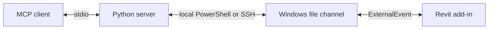

# Revit Model MCP

<!-- screenshot: hero -->

 [](https://github.com/sharafutdinovdi/revit-model-mcp/actions/workflows/ci.yml)   [](LICENSE)

## What it does

The server gives MCP clients read access to a live Autodesk Revit model.
Tools inspect elements, views, parameters and warnings.
Selected views can be exported to PNG for visual review.

## Why

Model inspection combines quantities and geometry.
An MCP client can discover model categories, aggregate element data and inspect selected views through the same connection.
The add-in handles Revit API access inside Revit.
The Python server can run on Windows or connect from another machine through SSH.

## In action

<!-- screenshot: export-view -->

Live Revit screenshots are pending.

## Quick start

This checkout is unreleased.
Windows build and live Revit validation are still required.
The add-in requires Windows and Revit 2022-2026.
The server requires Python 3.11 or later and uv.

On Windows with Revit closed, build the matching add-in from the repository root:

```powershell
dotnet build src/RevitModelMcp.Addin -c Release.R26
```

`DeployAddin` defaults to `true` in the add-in project.
Use `Release.R22` through `Release.R26` to match the installed Revit year.
Start Revit and open a model after deployment.

Register the server with Claude Code on that Windows machine:

```sh
claude mcp add revit-model-mcp -- uv run --directory /absolute/path/to/revit-model-mcp/server revit-model-mcp
```

Replace the directory with the local checkout path.
For a macOS or Linux client, append `--host ssh:revit-host` with an existing Windows SSH alias.
See [server setup](server/README.md) for configuration.

Ask the MCP client to call `revit_ping`.
The expected successful response has `command: "ping"` and `success: true`.
Then call `revit_document_info` to inspect the active model.
Supply `document` when multiple Revit instances are running.

## How it works



The server writes jobs to `%LOCALAPPDATA%\RevitModelMcp` on Windows.
The add-in processes them through ExternalEvent and writes JSON responses.
A heartbeat identifies each Revit instance and its active document.
The public tools read model data and export images without editing model elements.
See [architecture](docs/architecture.md) and [transport](docs/transport.md).

## Tools

<!-- Generated from decorated tool functions in server/revit_model_mcp/server.py. -->

| Tool | Purpose |
|---|---|
| `revit_ping` | Check the RevitModelMcp file channel without reading the model. |
| `revit_document_info` | Read general information about the active Revit model. |
| `revit_list_catalog` | Discover valid model names before filtering. |
| `revit_aggregate_elements` | Read a compact element summary after revit_list_catalog. |
| `revit_query_elements` | Read a page of elements after revit_list_catalog. |
| `revit_list_views` | Find views in the active model before analyzing a view. |
| `revit_view_summary` | Read element categories and counts for a selected view. |
| `revit_export_view` | Export a selected view to PNG when numbers do not explain geometry. |
| `revit_view_elements` | Read one page of elements in a selected view. |
| `revit_element_details` | Read all parameters of an element by Revit id. |
| `revit_view_warnings` | Read Revit warnings related to elements in a selected view. |
| `revit_list_warnings` | Group model warnings by text. |
| `revit_list_relations` | Read model object membership or dependencies. |
| `revit_list_instances` | List Revit processes with active documents, versions and processId. |

## Testing

The Python tests cover job construction, transport failures, downloads and MCP stdio registration.
Core tests cover parsing, serialization, formatting, units and query processing.
These tests do not require a live Revit model.

On Windows:

```powershell
dotnet build src/RevitModelMcp.Addin -c Release.R26 -p:DeployAddin=false
dotnet build src/RevitModelMcp.Addin -c Release.R22 -p:DeployAddin=false
dotnet test tests/RevitModelMcp.Core.Tests
```

On the MCP client:

```sh
cd server
uv run --with pytest pytest -q
```

<!-- screenshot: tests -->

## Compatibility

| Component | Configured support |
|---|---|
| Revit add-in | Revit 2022-2026 on Windows |
| Add-in configurations | `Debug.R22` through `Debug.R26`, `Release.R22` through `Release.R26` |
| .NET targets | .NET Framework 4.8 for Revit 2022-2024, .NET 8 for Revit 2025-2026 |
| Build SDK | Selected by `global.json` |
| Python server | Python 3.11+, MCP Python SDK 2+ |
| Local transport | Windows PowerShell under the Revit user's account |
| SSH transport | SSH client on Windows, macOS or Linux; Windows SSH host with PowerShell |

The CI workflow targets Revit 2022 and 2026 builds on Windows.
Live model validation and release packaging are pending.

## Author and license

Author and maintainer: Dinar Sharafutdinov.
Licensed under [MIT](LICENSE).
See [third-party notices](THIRD-PARTY-NOTICES.md) for dependency licenses.
