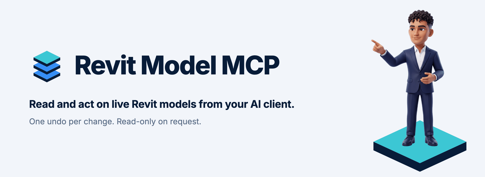
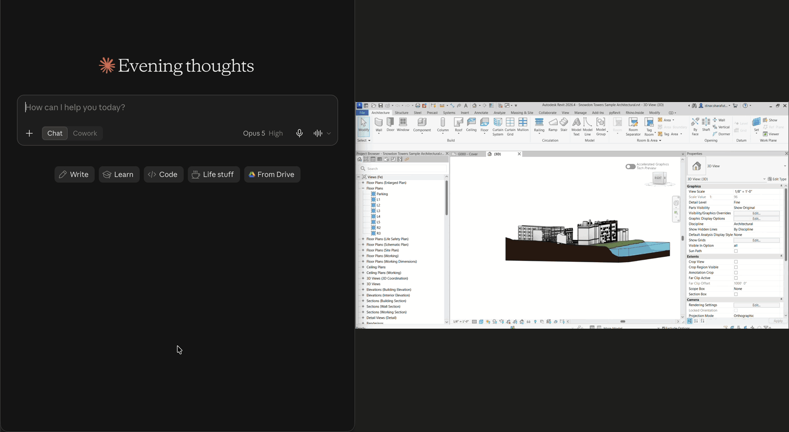
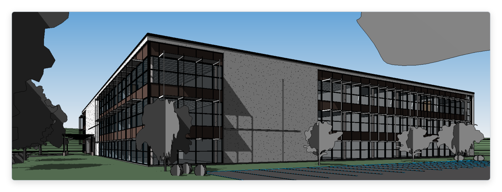

<h1 align="center">
  <picture>
    <source media="(prefers-color-scheme: dark)" srcset="docs/assets/hero-dark.png">
    
  </picture>
</h1>

Revit Model MCP connects an MCP client such as Claude Desktop or Claude Code to a live Revit project.
Ask questions about the model, check it, and change it in plain language.
Every change is one named undo entry in Revit, and read-only mode is one switch away.

[](https://github.com/sharafutdinovdi/revit-model-mcp/actions/workflows/ci.yml)
[](https://github.com/sharafutdinovdi/revit-model-mcp/releases/latest)
[](https://pypi.org/project/revit-model-mcp/)

[](https://scorecard.dev/viewer/?uri=github.com/sharafutdinovdi/revit-model-mcp)
[](LICENSE)



Claude Desktop runs on a Mac and connects to Revit 2026 on a Windows workstation.
Actions are enabled in this recording.

<details markdown="1">
<summary>What happens in the recording</summary>

1. "What model is open in Revit right now?" The client reads the document, levels and room counts.
2. "Which level has the most room area? Find the largest room and show it to me." The client aggregates room areas by level and queries the largest room.
   `revit_show` opens a matching plan and selects the room.
3. "Isolate that room, place a Chair-Breuer at its centre and move it 800 mm along X." `revit_isolate`, then `revit_place_family` at the room's `roomCenterMm`, then `revit_move`. Each mutation is its own Revit transaction.
4. Cleanup afterwards is one more sentence: reset the view, delete the chair.

</details>

## Quick start

You need two parts: the add-in inside Revit on Windows, and the server next to your MCP client.
Details and requirements are in [requirements and installation](https://sharafutdinovdi.github.io/revit-model-mcp/install/).

**1. Install the add-in.**
On the Windows machine with Revit, download `RevitModelMcp-<version>-SingleUser.msi` (current user) or `RevitModelMcp-<version>-MultiUser.msi` (all users) from the [latest release](https://github.com/sharafutdinovdi/revit-model-mcp/releases/latest).
Install only one of them.
Run it with Revit closed, start Revit and open a model.
Revit asks whether to load the add-in, because release builds are not code-signed yet.

**2. Add the server to your MCP client.**
Install [uv](https://docs.astral.sh/uv/getting-started/installation/), then register the server.
For Claude Code on the same Windows machine:

```sh
claude mcp add revit-model-mcp -e REVIT_MCP_HOST=local -e REVIT_MCP_REDACT_PATHS=1 -- uvx revit-model-mcp
```

For Claude Desktop, open the `revit-model-mcp-<version>.mcpb` bundle from the latest release, or add this to its MCP configuration:

```json
{
  "mcpServers": {
    "revit-model-mcp": {
      "command": "uvx",
      "args": ["revit-model-mcp"],
      "env": {
        "REVIT_MCP_HOST": "local",
        "REVIT_MCP_REDACT_PATHS": "1"
      }
    }
  }
}
```

On macOS or Linux, use a [remote workstation](#remote-workstations) instead of `REVIT_MCP_HOST=local`.
The [Claude Desktop bundle](https://sharafutdinovdi.github.io/revit-model-mcp/install/#claude-desktop-bundle) page explains its settings form.

**3. Ask a first question.**
Restart the client, keep a model open in Revit and ask: "Call `revit_ping`, then tell me which model is open."
`success: true` means both parts are connected.
From a clone, `uv run --directory server revit-model-mcp` runs the same server without installing the package.

## What it can do

The tables list every tool by name; the [tool reference](https://sharafutdinovdi.github.io/revit-model-mcp/tools/) has arguments, units and limits.

<a id="tools"></a>

### Review a model

Read the model, find problems and show them in Revit.
Reads change nothing in the document.
Exported pictures are the PNG files saved by `revit_export_view`; the image below is one of them, untouched.

<picture>
  <source media="(prefers-color-scheme: dark)" srcset="docs/screenshots/revit-model-mcp_export-view_dark.png">
  
</picture>

<details markdown="1">
<summary>Tools for reviewing a model</summary>

| Task | Tools |
| --- | --- |
| Check the connection and open documents | `revit_ping`, `revit_ui_state`, `revit_documents`, `revit_document_info`, `revit_list_instances` |
| Find and count elements | `revit_list_catalog`, `revit_aggregate_elements`, `revit_query_elements`, `revit_element_details`, `revit_list_relations` |
| Read views and schedules | `revit_list_views`, `revit_view_info`, `revit_view_summary`, `revit_view_elements`, `revit_schedule_data` |
| Read warnings | `revit_list_warnings`, `revit_view_warnings` |
| Check model quality | `revit_model_health`, `revit_parameter_fill_check`, `revit_family_audit` |
| Get a picture | `revit_export_view`, `revit_capture_elements` |
| Point at things in Revit | `revit_activate_view`, `revit_select`, `revit_show`, `revit_isolate`, `revit_override_graphics` |

</details>

### Coordinate links and datums

Compare and align grids and levels with linked models, inspect links and shared coordinates, and prepare CAD and Navisworks hand-overs.

<details markdown="1">
<summary>Tools for links and datums</summary>

| Task | Tools |
| --- | --- |
| Inspect links and coordinates | `revit_links_status`, `revit_shared_coordinates` |
| Compare and align datums | `revit_compare_link_datums`, `revit_align_link_datums` |
| Work with CAD links | `revit_link_cad`, `revit_walls_from_cad` |
| Remove links | `revit_remove_links` |
| Navisworks export | `revit_nwc_settings_check`, `revit_export_nwc` |

</details>

### Change the model safely

Edit elements, families, views and sheets.
Each change is one named undo entry, and the riskiest calls wait for your confirmation.
See [safety](#safety).

<details markdown="1">
<summary>Tools for changing the model</summary>

| Task | Tools |
| --- | --- |
| Edit elements | `revit_move`, `revit_rotate`, `revit_copy`, `revit_mirror`, `revit_change_type`, `revit_set_parameter`, `revit_update_parameters`, `revit_delete` |
| Run many steps as one undo | `revit_run_actions` |
| Create elements | `revit_create_wall`, `revit_create_mep_run` |
| Work with families | `revit_load_family`, `revit_place_family`, `revit_place_families`, `revit_edit_families` |
| Work with views and sheets | `revit_create_view`, `revit_duplicate_view`, `revit_apply_view_template`, `revit_set_view_visibility`, `revit_create_sheet`, `revit_place_views_on_sheet` |
| Open, save and close documents | `revit_open_document`, `revit_new_document`, `revit_activate_document`, `revit_close_views`, `revit_close_document`, `revit_save_document`, `revit_sync_document` |
| Export files | `revit_export` |
| Run C# in Revit | `revit_execute_code` |
| Undo | `revit_undo_last` |

</details>

### Process many models at once

Run the same checks, edits, exports and saves over a folder of models, or collect read-only snapshots from many models in a persistent run.
Long jobs return a `jobId` that survives client restarts.

<details markdown="1">
<summary>Tools for many models</summary>

| Task | Tools |
| --- | --- |
| Open, change, export and save many models | `revit_process_models` |
| Collect snapshots without changing models | `revit_batch_start`, `revit_batch_status`, `revit_batch_cancel`, `revit_batch_fetch` |
| Follow and cancel long jobs | `revit_jobs`, `revit_cancel_job` |

</details>

### Write an issue register with snapshots

Review a model against your requirements and write an Excel register with severity totals, element rows and element snapshots.
Snapshots also let you audit models later without Revit running.

<details markdown="1">
<summary>Tools for registers and reports</summary>

| Task | Tools |
| --- | --- |
| Take a snapshot of a model | `revit_model_snapshot` |
| Write an issue register | `revit_issue_register` |
| Build a report from snapshots | `revit_build_report` |

</details>

### Prompts and skills

The [prompts and coordinator guide](docs/prompts.md) describe read-only model review workflows.
For Claude Code, copy `skills/revit-model-coordinator` into `~/.claude/skills/`.
For Claude Desktop, zip that skill folder and upload it as a skill.

The hand-written [ISO 19650 issue register skill](skills/iso19650-issue-register/SKILL.md) reviews a model against EIR/BEP requirements and writes an Excel register with element snapshots.
Install it the same way: copy `skills/iso19650-issue-register` into `~/.claude/skills/`, or zip the folder and upload it in Claude Desktop.

## Safety

<a id="actions-opt-in"></a>

- **Actions are on by default.** Set `REVIT_MCP_READ_ONLY=1` in the server environment, or create the workstation `read-only` file, to refuse every action. Action tools stay listed and return `read_only` instead of running.
- **One undo per change.** A committed action is one named Revit undo entry, shown in Revit's Undo list and in the add-in's "MCP activity" pane. `revit_undo_last` undoes it while it is still Revit's last change.
- **Confirmation tokens for irreversible actions.** Saving, synchronizing, removing links and running C# always need one. Closing with changes, deleting more than 500 elements, overwriting existing export files and in-place saves in batch runs need one too. The first call changes nothing and returns the text to show you; the retry needs your explicit agreement. A token is single use and expires after five minutes.
- **Dry runs.** Model-changing tools such as `revit_move`, `revit_delete`, `revit_run_actions`, `revit_export` and `revit_process_models` accept `dry_run` to preview the result without committing it.
- **A readable summary.** Every action returns `verification` and a one-sentence `summary` of what changed.
- **Path redaction.** `REVIT_MCP_REDACT_PATHS=1` hides directories in response path fields. Names, parameter values and errors stay visible.
- **HTTP.** Direct HTTP callers need the bearer token and are refused while the workstation read-only file is present.

For unattended runs, switch on read-only mode.
A confirmation token guards against mistakes and injected instructions, but a client that confirms by itself can send it back.
See [actions](https://sharafutdinovdi.github.io/revit-model-mcp/actions/) for gates, exceptions and verification failures, [security details](https://sharafutdinovdi.github.io/revit-model-mcp/security/) for authentication and privacy boundaries, and [SECURITY.md](SECURITY.md) to report a vulnerability.

## Remote workstations

Local Windows clients use `REVIT_MCP_HOST=local` under the Revit user's account.
Remote clients run the whole server on the workstation over SSH, as the same Windows user that runs Revit.
Install it there once with `uv tool install revit-model-mcp`, then register `ssh` as the command:

```json
{
  "mcpServers": {
    "revit-model-mcp": {
      "command": "ssh",
      "args": ["revit-pc", "revit-model-mcp", "--redact-paths"]
    }
  }
}
```

Replace `revit-pc` with the workstation's SSH host alias.
MCP stdio flows through the SSH session and the remote server uses the named pipe, so no port opens.
`REVIT_MCP_HOST=ssh:<alias>` (file channel over SSH) and HTTP through an SSH tunnel remain available; HTTP requires a bearer token except for `/health` and binds to loopback by default.
See [transport setup](https://sharafutdinovdi.github.io/revit-model-mcp/transport/).

## Compatibility

Revit 2022 to 2027 on Windows 10 and 11.
The add-in targets .NET Framework 4.8 for Revit 2022-2024, .NET 8 for 2025 and 2026, and .NET 10 for 2027.
Every year builds, installs and runs live reads and actions.
The server needs Python 3.11 or newer, started through uv, and runs on Windows, macOS or Linux.
See [validation evidence](https://sharafutdinovdi.github.io/revit-model-mcp/validation/) for dates and limits, and [known gaps](https://sharafutdinovdi.github.io/revit-model-mcp/roadmap/#known-gaps).

## Privacy

Revit Model MCP returns requested model data to the selected MCP client.
The bundle enables response path redaction by default.
The project has no telemetry.
The [privacy policy](https://sharafutdinovdi.github.io/revit-model-mcp/privacy/) covers collection, update checks, the AI client data flow, storage, retention and contact information.
The server checks for a newer stable release once a day; set `REVIT_MCP_NO_UPDATE_CHECK=1` to opt out.

## Code signing policy

Release builds are not code-signed yet, so Revit asks whether to load the add-in after install and after each update.
Verify downloads with `SHA256SUMS.txt` and the build provenance attestation; see the [code signing policy](https://sharafutdinovdi.github.io/revit-model-mcp/code-signing/) and [download verification](https://sharafutdinovdi.github.io/revit-model-mcp/security/#verify-downloads).
See [automatic updates](docs/updates.md) for how the add-in updates itself.

## Contributing and support

[Documentation](https://sharafutdinovdi.github.io/revit-model-mcp/) covers setup, tools and transport.
Start with [CONTRIBUTING.md](CONTRIBUTING.md), ask questions in [Discussions](https://github.com/sharafutdinovdi/revit-model-mcp/discussions), or report bugs and request features through the [issue forms](https://github.com/sharafutdinovdi/revit-model-mcp/issues/new/choose).
CI runs the C# and Python test suites and builds the supported Revit configurations.
If Revit Model MCP saves you time, a :star: on GitHub helps other Revit users find it.

[](https://github.com/sharafutdinovdi/revit-model-mcp/graphs/contributors)

## License

[MIT](LICENSE), maintained by Dinar Sharafutdinov.
See [third-party notices](THIRD-PARTY-NOTICES.md) for dependency licenses.
