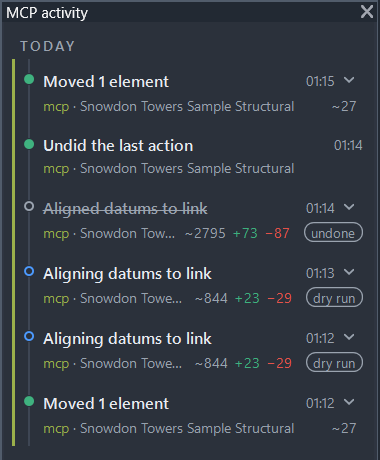
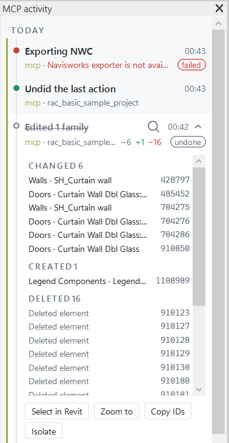

# Actions (enabled by default)

Actions run unless read-only mode is active: `REVIT_MCP_READ_ONLY=1` in the Python server environment, or the
workstation `%LOCALAPPDATA%\RevitModelMcp\read-only` file. Action tools stay listed either way; a refused call
returns `success:false` and `error:"read-only mode"` instead of running. See [Read-only mode](#read-only-mode).
Transaction warnings are dismissed and reported in `warningsDismissed` (omitted when empty); errors that cannot be safely resolved roll back the action.

Every action result carries a `summary`: one human sentence describing what changed, how many elements, and in
which document, alongside `verification`. A committed mutation assimilates its transaction into a single named
Revit undo entry, `MCP (<clientName>): <short summary>` (at most 60 characters), visible in Revit's Undo list and
in the add-in's "MCP activity" dockable pane (ribbon: RevitModelMcp tab, MCP panel, "Activity" button).
`select` and `show` make no document change and get no undo entry, but still appear in the activity pane.
See [Undo the last action](#undo-the-last-action) for `revit_undo_last`.

Action tools that target an open document accept `document`. `revit_process_models` uses `paths` or `folder` instead. `revit_export_nwc`, `revit_export`, `revit_edit_families`, `revit_align_link_datums` and `revit_execute_code` also accept `response_timeout_s` from 30 to 3600 seconds. `revit_process_models` accepts 30 to 14400 seconds.
Revit remains busy for the whole action duration.
Other listed tools use the default response timeout of 120 seconds. All actions use a pickup timeout of 300 seconds and require exactly one instance returned by the transport.
HTTP addresses one endpoint; the file transports discover workstation instances.
All IDs are unitless Revit element IDs.
Revit 2022-2023 accept IDs up to 2,147,483,647 only; larger IDs fail on those years.

Action jobs with `targetDocument` resolve that reference when the add-in executes the job.
The reference must match exactly one open document by a case-insensitive substring of its title or file name.
The resolved document is bound by its title and full path for all mutations and verification, even if another document is active.
An unknown or closed target returns `The addressed document '<TargetDocument>' is not open.`
An ambiguous target returns `The document reference '<TargetDocument>' is ambiguous (N open documents match); use a more specific substring.`
Resolution failure aborts the whole batch before any step runs; an addressed job never falls back to the active document.
The target is resolved once before the batch loop, and a later document or transaction failure is reported as a step error.
`select`, `show` and `isolate` (including `reset=true`) require the resolved document to be active.
Otherwise, they return `Cannot run '<command>' on '<title>' because it is not the active document; activate it in Revit first.`
Jobs without `targetDocument` retain the active-document behavior.
`activeView` always reports the actual active view, even when a mutation targets another document.

| Tool | Arguments | Action and units |
| --- | --- | --- |
| `revit_select` | `element_ids` | Select IDs; `[]` clears selection. Return `count`, the current selection size after the call. |
| `revit_show` | `element_ids`, `select=true` | Show nonempty IDs; return `activeView`, `viewOpened` and `count`, the current selection size after the call. With `select=false`, `count` reports the previous selection. |
| `revit_override_graphics` | `element_ids`, `color="#FF0000"`, `views="active"`, `halftone_others=false`, `line_weight=null`, `fill=true`, `transparency=0`, `reset=false` | Highlight visible elements in the active view, all eligible model views or named views. Reset restores graphics saved in the current Revit session. Returns `viewsTouched` and `elementsPerView`. |
| `revit_isolate` | `element_ids`, `reset=false` | Temporarily isolate IDs; `element_ids=[]` with `reset=true` clears hide/isolate. |
| `revit_move` | `element_ids`, `dx_mm`, `dy_mm`, `dz_mm=0` | Move by model-axis offsets in mm. |
| `revit_rotate` | `element_ids`, `angle_deg`, `center_mm=null` | Rotate around a vertical axis through the given model XY point in mm or the combined bounding box center. Pinned elements are refused. |
| `revit_copy` | `element_ids`, `dx_mm`, `dy_mm`, `dz_mm=0`, `count=1` | Create 1-100 copies at successive multiples of the offset. Return IDs per copy. |
| `revit_mirror` | `element_ids`, `axis`, `point_mm`, `copy=true` | Mirror across an X or Y parallel line through the model XY point in mm. Copy keeps originals. |
| `revit_change_type` | `element_ids`, `type_name`, `family=null` | Resolve each target among compatible types. Refuse ambiguous or incompatible targets with candidates. |
| `revit_update_parameters` | `filters`, `parameter`, `value`, `parameter_id=null`, `max_elements=5000`, `include_type_parameters=false` | Use query filters to update matching instance parameters. Refuse counts above the limit, at most 20000. Report missing, read-only and type-only parameters and preview up to 50 values. With `include_type_parameters=true`, update each distinct type once and report `affectedTypeIds` and `outsideFilterCount` for instances sharing those types outside the filter. |
| `revit_place_family` | `family`, `type_name`, `x_mm`, `y_mm`, `level`, `rotation_deg=0` | Place a loaded family at model XY in mm on a named level; rotate about Z in degrees. |
| `revit_load_family` | `paths` (1-100), `overwrite=false`, `overwrite_parameter_values=false`, `dry_run=false`, `response_timeout_s=600` | Load workstation `.rfa` files in one undo entry. Existing families are `skipped` unless overwrite is true. With overwrite, changed families are `reloaded`; an already loaded family that Revit leaves unchanged is `unchanged`. |
| `revit_place_families` | Exactly one of `placements` or `at_rooms`; `load=null`, `dry_run=false`, `stop_on_error=true`, `response_timeout_s=600` | Load optional families and place up to 2000 instances in one undo entry. |
| `revit_create_wall` | `start_mm`, `end_mm`, `level`, `wall_type`, `height_mm=3000` | Create a straight wall; endpoints are `[x,y]` in model mm. |
| `revit_create_mep_run` | `kind`, `points_mm`, `level`, `type_name=null`, `system_type=null`, `width_mm=null`, `height_mm=null`, `diameter_mm=null`, `offset_mm=null`, `connect_to=null` | Create 1-199 straight duct, pipe, cable tray or conduit segments from 2-200 model points in mm. Missing Z uses the level elevation plus 2700 mm for ducts and trays or 2500 mm for pipes and conduits. The first available type and system type are defaults. Set rectangular width and height or round diameter as applicable. Return `segmentIds`, `fittingIds`, `unjoinedPairs` and total `lengthMm`. An elbow that Revit cannot place leaves the pair unjoined. Connect the first start to a free connector within 50 mm when `connect_to` is supplied. |
| `revit_create_view` | `kind`, `name=null`, `level=null`, `view_family_type=null`, `template=null`, `scale=null`, `box=null`, `element_ids=null` | Create a floor, ceiling or structural plan, section, 3D or drafting view. Plans need a level. Section and 3D need a box or element IDs; element bounds expand by 1000 mm. Sections look along +Y. |
| `revit_duplicate_view` | `view`, `mode="duplicate"`, `name=null` | Duplicate a view, include detailing or create a dependent view. |
| `revit_apply_view_template` | `views`, `template` | Apply a matching template to one or more views. Type mismatches are reported in `typeMismatches`. |
| `revit_create_sheet` | `number`, `name`, `title_block=null` | Create a sheet with a loaded title block. Sheet numbers must be unique. |
| `revit_place_views_on_sheet` | `sheet`, `views` | Place views and schedules. Each item has `view` and optional paired `x_mm`, `y_mm` sheet coordinates. Missing positions lay out left to right with 20 mm gaps and row wrapping. Cannot run in a batch. |
| `revit_set_parameter` | `element_id`, `parameter`, `value`, optional `parameter_id` | Set exactly one instance or type parameter. `parameter_id` is a `BuiltInParameter` enum name, shared parameter GUID or positive decimal `ParameterElement` ID. `parameter` remains required. Without an ID, names accept the localized Revit UI name, a `BuiltInParameter` enum name or a supported English alias. Multiple matches are refused with each candidate's ID, name, storage type, owner and kind. No name guessing occurs. Use a JSON string for String, integer for Integer or number for Double. Lengths use mm, areas m2, other doubles internal units. |
| `revit_delete` | `element_ids` | Delete nonempty IDs and their dependents. |
| `revit_batch` | `steps`, `dry_run=false` | Execute 1-50 actions in one `MCP (<clientName>): ...` undo entry. |
| `revit_process_models` | `paths=null`, `folder=null`, `recursive=false`, `pattern="*.rvt"`, `open=null`, `steps=null`, `code=null`, `exports=null`, `save=null`, `stop_on_error=false`, `dry_run=false`, `confirm_token=null`, `response_timeout_s=14400`, `process_id=null` | Open and process 1-500 models in the interactive Revit session, then close each model. |
| `revit_export_nwc` | `path`, exporter options, `overwrite=false`, `dry_run=false`, `response_timeout_s=1800` | Export NWC to an absolute workstation path. Requires the matching Navisworks NWC Export Utility. |
| `revit_export` | `format`, `views=null`, `sheets=null`, `sheet_set=null`, `all_sheets=false`, `folder=null`, `options=null`, `overwrite=false`, `dry_run=false`, `response_timeout_s=1800` | Export PDF, DWG, IFC or schedule CSV files to a workstation folder. Cannot be used in a batch. |
| `revit_edit_families` | `operations`, `families=null`, `overwrite_parameter_values=false`, `stop_on_error=true`, `dry_run=false`, `response_timeout_s=1800` | Edit open family or named project families; one load cycle per family. |
| `revit_align_link_datums` | All `revit_compare_link_datums` arguments, `create_missing=true`, `level_type=null`, `grid_type=null`, `include_pinned=false`, `create_plan_views=false`, `plan_view_type=null`, `dry_run=false`, `response_timeout_s=600` | Move same-name grids and levels to a linked model; optionally create missing datums and floor plans. Cannot be used in a batch. |
| `revit_set_view_visibility` | `view`, `hide_categories=null`, `show_categories=null`, `category_classes=null`, `hide_categories_by_type=null`, `worksets=null`, `filters=null`, `template_mode=null`, `dry_run=false` | Change view category, class, workset and filter visibility. Cannot be used in a batch. |
| `revit_remove_links` | `links` (names, IDs or `"*"`), `kinds=["revit","cad","point_cloud"]`, `include_imported_cad=false`, `dry_run=false` | Remove selected link types and their instances. Cannot be used in a batch. |
| `revit_execute_code` | `code`, `transaction="auto"`, `dry_run=false`, `response_timeout_s=600` | Compile and run C# on the Revit API thread. Cannot be used in a batch. |
| `revit_undo_last` | `document` | Undo the last MCP action through Revit's own undo command; refused unless it is still Revit's last undo entry. |

Category names in `hide_categories` and `show_categories` accept the Revit UI name, the `BuiltInCategory` name (`OST_StructuralColumns`, with or without the prefix), the English name (`Structural Columns`) or the category ID, independent of the Revit UI language. An unknown name is rejected with close matches drawn from all three forms. `revit_view_elements` and the universal query filters resolve category names the same way.

`category_classes` maps `model`, `annotation`, `analytical`, `import` and `point_clouds` to booleans (`true` means hidden). `hide_categories_by_type` accepts those class names and hides each matching category. `worksets` has `hide_mask` and `show_mask` lists; masks are case-insensitive globs (`*`, `?`) or regular expressions prefixed with `regex:`. The response lists matched worksets, before/after values and categories Revit could not hide. `filters` contains `{name, visible}` records. When a template is applied, choose `template_mode`: `detach` clears it on this view, `edit_template` changes it for all views using the template and lists them, or `duplicate_view` creates a copy without it. A missing mode is rejected.

Link removal refuses central-connected workshared documents. A local copy is allowed with a warning that sync propagates deletion. Non-linked CAD imports remain unless `include_imported_cad=true`. A real removal returns `warning: "Removing links cannot be undone in Revit; Undo will not restore them."` The warning is set before deletion. `revit_undo_last` refuses after link removal for this reason. `dry_run` applies the proposed changes within a transaction and rolls it back without committing.

Alignment uses one host-document transaction, with `dry_run` rolling it back after prospective results are read. Pinned and other-user-owned datums are skipped. Existing datums are never renamed or deleted, and grid extents and scope boxes are never changed. Moving levels also moves elements hosted on them; moved-level results include `dependentCount`. Created datums report their ID and workset. Geometric alignment does not create a monitor relationship or later Coordination Review warnings.

### Execute C# code

`revit_execute_code` accepts up to 200,000 C# characters. Submit either the body of `public static object Execute(ScriptContext ctx)` or a full compilation unit declaring `public static class Script` with that method. Method bodies have common `System` and Revit namespaces imported. `ScriptContext` provides `UiApplication`, `Application`, `UiDocument`, `Document`, `Log`, `ToMm` and `FromMm`. The target document follows the normal `document` resolution rules. In `transaction="none"`, `Document` may be null when no document is open.

The default `auto` mode owns one Revit transaction inside a group. Scripts in this mode must not open transactions. A successful call creates one undo entry named `MCP (<client>): Execute code`. `dry_run=true` runs the code and rolls back the group. Runtime errors also roll it back. The `none` mode lets the script own transactions and open or close documents; undo is not guaranteed, and `dry_run` is rejected. The response includes `returnValue`, up to 2,000 `log` lines, elapsed time, summary and any undo name or warning. Return values have a depth limit of 6 and at most 5,000 collection items. Revit elements, IDs and XYZ points get compact JSON forms. Plain classes and anonymous types return public readable properties as JSON objects. Other Revit API objects use `ToString()`. Numbers use invariant culture. Compile and runtime failures have summaries starting with `Code failed to compile` and `Code failed`, respectively.

Compiler errors include diagnostic IDs, messages, and positions in the submitted code. Runtime errors include their type, message and script frames. The compiler caches up to 32 compiled scripts. On .NET Framework, loaded script assemblies remain in memory until Revit restarts. The add-in cannot stop a running script; `response_timeout_s` only limits the server wait. Inspect Revit state before retrying after a timeout.

The activity pane shows the first non-empty source line and a SHA-256 prefix. Source is stored in `%LOCALAPPDATA%\RevitModelMcp\code`; the newest 500 files are retained. The audit header records client, document title and transaction mode. When path redaction is on, Windows paths in the activity line and stored source are replaced with redaction markers.

### Model file export

`revit_export` writes to `folder`, or to `%LOCALAPPDATA%\RevitModelMcp\exports\<document title>\<UTC timestamp>` when omitted. The folder must be an absolute drive path or a UNC path under `trustedNetworkRoots`. Device paths and `..` segments are refused. Existing output files require `overwrite=true`. `dry_run=true` returns resolved targets and planned names without writing. The result includes `folder`, `files` with sizes, `targets`, `skipped`, `elapsedMs` and `summary`. File export changes no model elements and creates no undo entry.

PDF and DWG accept any combination of view names or IDs, sheet numbers, names or IDs, a saved `sheet_set`, and `all_sheets=true`. At least one printable target is required; templates and unprintable views are rejected. PDF `options` are `combine=true`, `file_name`, `naming="sheet_number_name"` or `"view_name"`, `color="color"`, `"grayscale"` or `"black_line"`, `zoom_percent=100`, `paper="auto"`, `hide_crop_boundaries=true` and `hide_scope_boxes=true`. DWG options are `setup` (saved export setup), `merged_views=false` and `file_version` (Revit ACADVersion name).

IFC exports the whole model or one view selected through `views`. Its options are `version="IFC2x3CV2"`, `"IFC4RV"` or `"IFC4x3"`, `file_name`, `export_base_quantities=true`, `space_boundaries=0` and `split_walls_by_level=false`. The required IFC transaction is rolled back after export. CSV accepts schedule names or IDs in `views`; omitting `views` exports all non-template schedules except revision and keynote legends. CSV options are `delimiter=","`, `headers=true`, `title=false`, `group_headers=false` and `encoding="utf-8"`. Revit exports the visible schedule fields. The file is then encoded as UTF-8 with a BOM for Excel. With path redaction enabled, the response `folder` contains only the final folder name.

### Process many models

`revit_process_models` accepts either 1-500 absolute `.rvt` paths or a local or UNC `folder` with `recursive` and a `.rvt` file pattern. RSN model paths are accepted in `paths`; cloud paths are refused. `trustedNetworkRoots` applies to UNC paths. Already open models are skipped. Each model opens in the background with the `revit_open_document` `mode`, `worksets`, and `audit` options. The active document is left in place. The action uses the interactive Revit session, not the read-only batch collector worker.

`steps` uses the same 1-50 step allowlist as `revit_batch`, and `code` uses `{"code":"...","transaction":"auto"|"none"}`. The script runs after the steps with `ScriptContext.Document` set to the processed model. `exports` is a list of `revit_export` requests without `document`; an export folder can contain `{model}`. Without an export folder, files go to `<save.output_dir>\<model>` when an output directory is set, or `%LOCALAPPDATA%\RevitModelMcp\exports\<model>` otherwise. The result reports each model's open settings, step summary, script return value and log, export files, saved path, `dialogsDismissed`, elapsed time, status, and error. `dialogsDismissed` is `{ "messages": [{ "message": "...", "count": 1 }], "truncated": false }`; it combines dismissed dialogs and warnings, retains up to 50 distinct messages, and counts repeats. `truncated=true` means further distinct messages were omitted. A failed model does not stop later models unless `stop_on_error=true`. `revit_jobs` reports that the job is running, but has no per-model progress fields; the server waits up to `response_timeout_s`.

The final response has `partial=true` when at least one model fails and includes the results for all processed models.

`save.mode` is `none` by default. `output_dir` saves copies with the original file names and refuses a target equal to any source. Detached workshared models are saved as new centrals. `in_place` is allowed only for non-workshared local or UNC models opened directly, without `local_copy` or `read_only_local`. Its first call returns `needsConfirmation`, `confirmationText` listing writable source files, and `confirmToken`. Read-only source files appear in `models` with status `refused` and error `read-only file`; they are excluded from the token and processing. If every source is read-only, the call fails without a token. Retry with `confirm_token` only after reviewing the list. `dry_run=true` opens each model, runs steps and code inside a rolled-back transaction group, resolves exports without writing, and never saves. `code.transaction="none"` is incompatible with `dry_run` because the script owns its transactions.

### NWC export options

The API export uses explicit arguments, then values from `settings_xml`, then the existing API defaults. The XML file must be on the Revit workstation. The target must be a project document. The NWC file stays on the Revit workstation; no artifact is transferred to the client. This action cannot run inside `revit_batch`.

| Argument | Default | Revit API property |
| --- | --- | --- |
| `path` | required | `Document.Export` folder and name without `.nwc` |
| `settings_xml` | `null` | Absolute path to an XML exported from Navisworks Settings on the Revit workstation |
| `scope` | `model` | `ExportScope`: `model`, `view`, `selection` |
| `view` | `null` | `ViewId`; non-template 3D view name or ID, required for `view` scope |
| `element_ids` | `null` | `SetSelectedElementIds`; nonempty for `selection` scope |
| `coordinates` | `shared` | `Coordinates`: `shared`, `internal` |
| `parameters` | `all` | `Parameters`: `all`, `elements`, `none` |
| `export_element_ids` | `true` | `ExportElementIds` |
| `convert_element_properties` | `false` | `ConvertElementProperties` |
| `export_parts` | `false` | `ExportParts` |
| `export_room_as_attribute` | `true` | `ExportRoomAsAttribute` |
| `export_room_geometry` | `true` | `ExportRoomGeometry` |
| `convert_lights` | `false` | `ConvertLights` |
| `convert_linked_cad_formats` | `true` | `ConvertLinkedCADFormats` |
| `export_links` | `false` | `ExportLinks` |
| `export_urls` | `true` | `ExportUrls` |
| `divide_file_into_levels` | `true` | `DivideFileIntoLevels` |
| `find_missing_materials` | `true` | `FindMissingMaterials` |
| `faceting_factor` | `1.0` | `FacetingFactor`, greater than 0 and at most 100 |
| `overwrite` | `false` | Replace an existing NWC only after successful export |
| `dry_run` | `false` | Validate without exporting |
| `response_timeout_s` | `1800` | Channel response timeout, 30-3600 seconds |

`path` must be an absolute drive path or a UNC path whose share is in `trustedNetworkRoots`, ending in `.nwc` with an existing parent directory. Relative paths, `..` segments, device paths, invalid file names and existing files without `overwrite=true` are rejected. A dry run checks the path, exporter and resolved view or selection, then returns effective options without writing. `scope="view"` exports the specified 3D view with its section box. The response `options` contains effective values and a `sources` object with `argument`, `xml` or `default` for each option. `revit_nwc_settings_check(settings_xml=...)` parses the same file without exporting and returns `values`, exporter-ID-to-API `mapping`, `notApplied` and `ignored`. The XML options `nwexportrevit_embed_textures`, `nwexportrevit_with_type_props`, `nwexportrevit_separate_custom_props` and `nwexportrevit_strict_sectioning` have no Revit API property and appear in `notApplied`. Unknown IDs appear in `ignored`. The mappings for parameter, scope and coordinate enum order await verification against an owner-exported XML file.
`settings_xml` for export uses the same share rule and rejects device paths and `..` segments.

### Family edits

In an open `.rfa`, omit `families`. The add-in edits it in place and leaves saving to the user. In a project, pass 1-200 exact family names or `["*"]`; in-place, non-editable, missing and other-user-owned families are skipped with reasons. The add-in opens each family, applies operations in order inside one family transaction, then loads it into the project with one project undo entry. A dry run re-reads the prospective family and rolls back without loading. The command is excluded from `revit_batch`.

Operations use snake_case `op` values:

```json
{"operations":[
  {"op":"add_shared_parameters","parameters":[{"name":"AssetId","guid":null,"group":"Data","instance":true}],"replace_family_parameter":false,"shared_parameter_file":null},
  {"op":"remove_parameters","names":["Old"],"include_shared":false},
  {"op":"purge"},
  {"op":"set_shared","shared":true}
]}
```

`add_shared_parameters` reads definitions from the named absolute workstation file or Revit's current shared parameter file. A GUID identifies a definition; name lookup must be unique across groups. `group` is a `GroupTypeId` property name. Existing GUIDs are unchanged; same-name conflicts need `replace_family_parameter=true`. `remove_parameters` removes only unused parameters. Formula references, associations and labels keep a parameter; shared parameters also need `include_shared=true`. Built-in parameters remain. `purge` repeats up to five passes and reports deletion counts. Revit 2022-2023 covers only unused families and types; Revit 2024 and later uses full purge candidates. `set_shared` reports unsupported families and verifies the loaded project state. Shared nested families keep the project version during load. `overwrite_parameter_values=true` replaces existing project type parameter values; instance values remain.
Client supplied `shared_parameter_file` must be a drive path or a UNC path whose share is in `trustedNetworkRoots`.

With `stop_on_error=true`, the first failed family rolls back the whole project group and reports `failedFamily`. With `false`, that family's load is rolled back and later families continue. A shared-to-non-shared overwrite may fail verification; delete and reload that family manually if Revit keeps its previous shared state.

`type_name` and `wall_type` are required arguments that accept `null`.

`revit_override_graphics`, `revit_move`, `revit_rotate`, `revit_copy`, `revit_mirror`, `revit_change_type`, `revit_update_parameters`, `revit_place_family`, `revit_create_wall`, `revit_create_mep_run`, `revit_create_view`, `revit_duplicate_view`, `revit_apply_view_template`, `revit_create_sheet`, `revit_place_views_on_sheet`, `revit_set_parameter` and `revit_delete` accept `dry_run=false`.
A dry run executes the mutation, reads its prospective result, and rolls back its transaction. Dry runs never commit. The activity pane lists elements reported by the action result.
A successful dry run includes `data.dryRun:true`, `data.rolledBack:true` and the same `verification` shape as a real write.
An action that throws returns an error without a verification block; a missing family also returns `closestFamilies` on the single-action tool.
`revit_isolate` has no `dry_run` argument; it uses temporary isolation only.
Created IDs in a dry run are provisional and do not identify persisted elements.

Successful real writes return `data.dryRun:false` and re-read the affected elements after commit.
`verification.before` is captured before the change; `verification.after` is re-read after commit or before rollback on a dry run.
`verification.error` reports a failed post-commit re-read; the change is committed.
Single-action responses include `failedStep:null`.
The `verification` block contains model facts: bounding boxes for moves, parameter values and ownership for parameter edits, element metadata for creation, and deleted/dependent IDs with a survival check for deletion.
Bounding boxes use model XYZ in mm rounded to one decimal; unavailable bounding boxes are omitted.
For example, setting Comments on element 123 returns:

```json
{
  "dryRun": false,
  "verification": {
    "before": {"id": 123, "parameter": "Comments", "value": "", "storageType": "String", "owner": "instance"},
    "after": {"id": 123, "parameter": "Comments", "value": "Reviewed", "storageType": "String", "owner": "instance"},
    "changed": [123]
  }
}
```

`revit_place_families` accepts placement records with `family`, `type_name`, `x_mm`, `y_mm`, `level`, optional `z_mm`, `rotation_deg`, `host_id` and `parameters`. `z_mm` is an offset above the level. `host_id` addresses a wall, floor or ceiling, including its nearest usable face for a face-based family. Parameter names follow `revit_set_parameter` resolution rules. A failure rolls back every placement by default. With `stop_on_error=false`, failed indices and reasons are returned while successful items commit. `at_rooms` selects placed, enclosed rooms by optional level and room names or numbers; unplaced and unenclosed rooms are reported as `skipped`. The result includes `placed`, `failed`, `createdElementIds`, `perTypeCounts`, `summary` and `verification`. A dry run rolls back all changes. The `load` list uses the same workstation path checks as `revit_load_family`.

`revit_batch` takes action names and their normal snake_case arguments:

```json
{
  "steps": [
    {"action": "move", "args": {"element_ids": [123], "dx_mm": 100, "dy_mm": 0}},
    {"action": "set_parameter", "args": {"element_id": 123, "parameter": "Comments", "parameter_id": "ALL_MODEL_INSTANCE_COMMENTS", "value": "Reviewed"}}
  ],
  "dry_run": false
}
```

A successful batch assimilates its transactions into one undo entry named `MCP (<clientName>): <short summary>`; a dry run assimilates nothing and `undoName` is absent.
The first failed step rolls back the entire batch; every attempted step, including the failing one, carries `rolledBack:true`.
An `Assimilate` failure is reported on the last step with `failedStep` pointing at it.
All steps are validated before execution; an invalid later step rejects the whole batch without executing anything and without `failedStep`.
Results include zero-based `index`, `command`, `success` and `data` or `error` per attempted step, plus `undoName`, `committed` and `failedStep` (null on success).
A batch dry run previews each step against the unchanged model, rolls back each step's transaction and the batch group, and restores the original selection. A later step cannot use an element created by an earlier preview step.
A per-step `dry_run:true` inside a real batch is accepted and previews only that step.
Verification describes each step's immediate result; subsequent steps may change those elements again.
Batches accept 1-50 steps; `select` and `isolate` are allowed, while `show`, nested batches and unknown argument keys are rejected.

`revit_show` checks the open UI views before calling `ShowElements`.
If none contains a requested element, it opens a non-template plan for an element's level.
Floor plans take priority, followed by names starting with the level name.
Without a matching plan it uses the first non-template 3D view.
The handler sets `UIDocument.ActiveView` synchronously inside its ExternalEvent without a transaction; `ShowElements` needs the view active immediately.
`RequestViewChange` defers the change until control returns to Revit.
The response includes `activeView` and `viewOpened`, which reports whether the handler opened a previously closed view.

During action execution, the handler attempts to dismiss TaskDialog prompts with OK and then Yes.
Messages from successful overrides appear in `dialogsSuppressed`.
The dialog handler is removed in `finally`, including on errors.
For the single-action `revit_place_family` tool, missing families return up to five similar names with their family categories in `closestFamilies`; unrelated names are omitted.
Inside `revit_batch`, a missing family surfaces only as `steps[].error` text; `closestFamilies` is unavailable.
For `Family: Type`, `type_name=null` uses the embedded type; a conflicting `type_name` is rejected.
For a family name alone, `type_name=null` selects the first loaded type.

### Read-only mode

Actions run by default. Either gate below independently switches Revit into read-only mode, with the action
tools still listed and returning `success:false`, `error:"read-only mode"` instead of running:

1. Set `REVIT_MCP_READ_ONLY=1` in the Python server process environment and restart the server.
   Every action call short-circuits before it reaches Revit, including `revit_undo_last`.
2. Create `%LOCALAPPDATA%\RevitModelMcp\read-only` on the Revit workstation:

   ```powershell
   New-Item -ItemType Directory -Force "$env:LOCALAPPDATA\RevitModelMcp" | Out-Null
   New-Item -ItemType File -Force "$env:LOCALAPPDATA\RevitModelMcp\read-only" | Out-Null
   ```

The add-in checks the gate file for every action, including selection and navigation, and shows a "Read-only"
bar at the top of the MCP activity pane while it is present.
Removing the file re-enables actions immediately; restarting Revit is unnecessary.
The gate stays in the default local application data directory even if the transport uses `REVIT_MCP_CHANNEL_DIR`.
Direct HTTP action jobs are refused the same way, with HTTP status 403.

Earlier versions required `REVIT_MCP_ALLOW_WRITE=1` and a workstation `allow-write` file before any action ran, and
hid action tools otherwise. That opt-in gate is removed: actions run by default now, and the two settings above
are an opt-out instead.

Actions address the process ID reported by the transport.
Coordinates use model axes and the named level's project elevation.
Pass `null` for `type_name` to choose the family's first type, or for `wall_type` to choose the first basic wall type.
Family placement uses the level-based, nonstructural overload; hosted, face-based and adaptive families may require another placement API and return an error.
The single-action family placement tool returns up to five closest loaded names for an unloaded family.
Parameter values use invariant numeric notation; other Double parameters use Revit internal units.
Type parameter edits affect all instances of that type and return `parameterScope:"type"`.
ElementId and read-only parameters cannot be set.

Responses from the action executor include `activeView`, including action errors.
Transport rejection and target-mismatch responses may omit action metadata.
A committed single action or batch runs inside a `TransactionGroup` assimilated into one undo entry named
`MCP (<clientName>): <short summary>`, truncated to 60 characters; `clientName` comes from the calling MCP
client's `initialize` handshake, or `unknown`. `select`, `show`, `export-nwc` and `revit_compare_link_datums`
make no document change and open no such group.
Warnings at commit are dismissed and reported on successful actions.
Errors permit one `FixElements` or `SetValue` resolution when Revit allows it; unresolved or repeated errors roll back the transaction.
Selection and navigation use UI calls without model transactions.
The element editing tools do not save the model. Document lifecycle tools below can save it after confirmation.
After a timeout, inspect the model before retrying an action; the previous call may have executed.

## Document lifecycle

`revit_documents` is a read tool that lists all documents in one Revit process, including background documents. Each row reports `title`, `path`, `isActive`, `isFamilyDocument`, `isWorkshared`, `isDetached`, `isModified`, `openedByMcp` and `centralPath` when available. It works even when no document is active.

`revit_ui_state` is a read tool with only optional `process_id`. It returns `activeDocument`, `activeView`, `openViews`, `selection` and `documents`. The selection count covers all selected elements; `elements` contains the first 500 with ID, category and name. Paths follow the existing redaction rules.

| Tool | Arguments | Action |
| --- | --- | --- |
| `revit_open_document` | `path`, `mode="detached"`, `worksets="all"`, `activate=false`, `audit=false` | Open a local, UNC or RSN model. |
| `revit_activate_document` | `document` | Switch to an already open document. |
| `revit_activate_view` | `view`, `document=null`, `activate_document=false`, `view_type=null` | Switch to a non-template view. |
| `revit_close_views` | `views=null`, `keep_active=true` | Close UI views in the active document. |
| `revit_new_document` | `template=null`, `kind="project"`, `activate=true`, `save_as=null`, `name=null` | Create a project or family document. |
| `revit_close_document` | `document`, `save=false`, `confirm_token=null` | Close a background document. |
| `revit_save_document` | `document`, `save_as=null`, `overwrite=false`, `compact=false`, `confirm_token=null` | Save an open document. |
| `revit_sync_document` | `document`, `comment`, `relinquish="all"`, `compact=false`, `save_local_before=true`, `save_local_after=true`, `confirm_token=null` | Synchronize a workshared document. |

`revit_open_document` opens a local or UNC `.rvt`/`.rfa`/`.rte` file, or `RSN://server/folder/model.rvt`. It defaults to `mode="detached"` and opens in the background. `activate=true` opens it in the Revit UI. The other modes are `detached_discard_worksets`, `local_copy` and `read_only_local`. A local copy is created under `%LOCALAPPDATA%\RevitModelMcp\locals`; an existing destination is refused. `read_only_local` accepts only a non-central file with the read-only file attribute. Cloud paths are outside this contract. `worksets` accepts `"all"`, `"none"`, `{"open":["Arch*", "Shared Levels and Grids"]}` or `{"close":["*Link*"]}`. Wildcards `*` and `?` are case insensitive. Unknown exact names fail; unmatched patterns appear in `worksetPatternsUnmatched`. `audit=true` reports `audited:true`; audit may take minutes, uses a 30 minute response timeout, and its dialogs use the existing dismissal handler.
If the file is already loaded as a Revit link in an open model, the action refuses it and names the host model. Unload the link or open the file in another Revit session.
On a non-workshared model, `none` and workset patterns are ignored with `warning: "Worksets ignored: the model is not workshared."`. A list containing only exact workset names still fails.
Its `path` accepts local UNC central files when their share is in `trustedNetworkRoots`; device paths and `..` segments are rejected.

`revit_activate_document` resolves exactly one open document by the existing title or path rules. A document without a saved path cannot be activated. Revit must keep the same document and document count, using Revit document identity across managed wrappers. If Revit opens an extra copy, the action restores the previously active saved document before closing the copy. If that is impossible, the error names the copy left open. `revit_activate_view` resolves a name or ID in the target document and rejects templates. IDs take priority. Ambiguous names are refused with candidate IDs, names and types. Use `view_type`, with the same case-insensitive Revit type names as `revit_list_views`, to select one type. Set `activate_document=true` to switch documents first. It reports the active view and whether it was already open. `revit_close_views` defaults to closing all views except the active one. It reports a refused last or active view without failing the call.

`revit_new_document` uses the default project template unless `template` is supplied. Family creation requires a `.rft` template; project templates use `.rte`. Template and `save_as` paths follow the existing path and trusted network root rules. An existing `save_as` target is refused. With `activate=true` and no `save_as`, the document is saved under `%LOCALAPPDATA%\RevitModelMcp\new` so Revit can activate it. Activation keeps the created document when Revit returns another wrapper for it. If Revit opens a separate copy, the action closes only the background original. The action checks that documents open before creation remain open. `name` sets the temporary file name without an extension and must be a safe file name. The default is `Project yyyyMMdd-HHmmss` or `Family yyyyMMdd-HHmmss`; an existing file adds a numeric suffix. `revit_ui_state.activeView.isActive` is true, and `openViews` marks the active view. Session actions have activity entries and summaries but no model transaction or undo entry. They are not batch steps and are refused in read-only mode.

`revit_close_document` closes a background document. The active document cannot be closed through this tool. `save=false` is the default. Closing a modified document without saving needs confirmation, except an MCP-opened detached document that has not been saved to central. Closing with `save=true` always needs confirmation.

`revit_save_document` always needs confirmation. It accepts `save_as`, `overwrite=false` and `compact=false`. Saving an open central model is refused. A detached workshared document saved under a new path becomes a central model; a destination matching a known central path is refused.
`save_as` accepts drive paths and UNC paths on trusted shares, and `overwrite=true` refuses an existing central or workshared file or a file that cannot be inspected.

`revit_sync_document` always needs confirmation and a non-empty `comment`. It rejects detached and family documents. `relinquish` is `"all"`, `"none"` or a map of `borrowed`, `user_worksets`, `family_worksets`, `view_worksets` and `standard_worksets` booleans. `compact=false`; `save_local_before` and `save_local_after` default to true. The central lock callback does not wait for a lock.

For confirmation, call the tool once without `confirm_token`. The first response has `data.needsConfirmation=true`, `data.confirmationText` and `data.confirmToken` and makes no change. Show the exact confirmation text to the user. Retry with the same arguments plus `confirm_token` only after explicit agreement in chat. Tokens expire after five minutes, are single use and are bound to the command, document, arguments and document state; a change after the preview requires a new token. A token guards against accidents, not against an agent replaying it; use read-only mode for unattended runs. A timeout after the second call may follow a committed save or sync; inspect the model before retrying.

These operations require no open transaction and cannot be included in `revit_batch`. Read-only mode applies. A committed open, close, save or sync carries a `summary` and appears in the MCP activity pane, but opens no undo entry: use Revit's own history for these document-level changes.

### Undo the last action

`revit_undo_last` undoes the most recent MCP action through Revit's own Undo command
(`PostableCommand.Undo`), never by reversing the mutation programmatically. It is allowed only when all of
the following hold, tracked from Revit's `DocumentChanged` event:

- the addressed document is the active document;
- no command is currently pending in Revit;
- the name Revit reports for its last undo entry still equals the name recorded for the most recent
  activity entry. Link removal is excluded because Revit cannot restore removed links through Undo.

Otherwise it refuses with a clear reason, for example `the last change in Revit is not ours: Move Elements`
when the user made an unrelated edit since the last MCP action, or `there is no recorded MCP action to
undo` when nothing has run yet. Only the single most recent action is covered; there is no redo and no
undo of an older entry. The same button appears on the newest row of the activity pane, disabled once it no
longer applies.

### MCP activity pane




The add-in keeps an in-memory ring buffer of the last 500 finished action jobs, also appended as JSON lines
to `%LOCALAPPDATA%\RevitModelMcp\activity.log`: time, client, command, document, state (`done`, `failed` or
`dry_run`), `summary`, the changed, created and deleted elements with category, name and ID, their true
totals, the undo entry name, and whether it was later undone.
Once `activity.log` exceeds 5 MiB, the next entry rotates it to `activity.1.log`, replacing the previous rotated file.

For committed jobs, the element lists are exact. While a job runs a model transaction, the add-in subscribes to Revit's
`DocumentChanged` event for the target document only and collects the added, modified and deleted element
IDs of every transaction the job commits, including transactions Revit itself opens, such as a family load.
An element added and later deleted within the same job cancels out and is not listed, whether or not it has
a category; this also drops it from Changed if it was reported as changed before being deleted. Internal
elements without a category are otherwise skipped, except views, sheets, levels and grids, so a view
visibility change lists the view. Each list stores the first 5000 elements; the chip counts and the expanded
lists use the true totals, including dependents such as dimensions that move with an element. The row title
instead uses the action's own target count (for example "Moved 1 element" for a single moved link, even
though its dependent dimensions also changed), falling back to the true totals when a command has no
well-defined target count. Dry runs never commit, so their element lists come from the action result: requested
element IDs, aligned host datums, removed link types and instances, or the affected view. These lists do not
include incidental dependents unless the action result reports them explicitly, as deletion does. IDs created
during a dry run are provisional.

Toggle the dockable pane with the "Activity" button in the MCP panel on Revit's Add-Ins tab. The pane is English in
every Revit UI language. Rows are grouped by day, newest first: "Today", "Yesterday", a weekday name within
the last six days, then a date such as "Sep 21" (or "Sep 21, 2025" in an earlier year). Labels use the local
calendar date of the entry and of now, so they follow midnight and daylight saving changes; the pane refreshes
them when the date changes.

Each row sits on a status rail: a title with the element count, time, client name in a stable client colour,
document, and change chips `~N` (changed), `+N` (created) and `−N` (deleted), plus "dry run", "undone" and
"failed" tags; failed rows show the error message. Hovering a row reveals "Select in Revit" (select and zoom
to every element that still exists) and, on the newest eligible row, "Undo". A chevron appears on every row
that has elements. Expanding it lists the elements under "Changed", "Created" and "Deleted" headers with
counts, each as `Category · Name` with its ID. Long lists show the first 100 elements, then "Show all N".

Click, Ctrl+click and Shift+click select elements in the list; double-click selects that element in Revit and
zooms to it. "Select in Revit", "Zoom to" and "Isolate" (temporary isolation in the active view) act on the
selected elements, or on every element that still exists when nothing is selected. "Copy IDs" copies the
selected IDs, or all listed IDs, comma-separated; Ctrl+C does the same. Deleted elements and elements a dry run
created are listed but cannot be selected. Selection works only while the entry's document is the active
document; otherwise the row shows "Open this document to select elements".

A live strip above the log names the running job and opens the queue of jobs still waiting on this Revit
instance, each with a "Cancel" link. The API `summary` stays in English.
`Document` is always `Document.Title`, a file name, never a directory, so nothing in the log needs path
redaction.

## Supervised batch mode

The [batch collector](batch.md) uses a separate worker with an add-in read-only allowlist. Every action command is refused in that worker. Document lifecycle tools accept `process_id` (alias `processId`) to select one running instance; an explicit PID and supplied document must agree.
