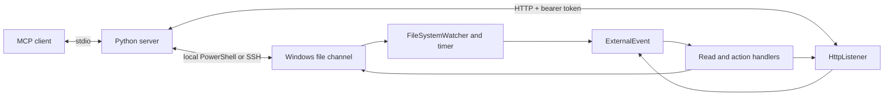

# Architecture

## Components

The [Python server](../server/revit_model_mcp/server.py) registers read tools and optional action tools, then constructs jobs.
[RevitReadChannel](../server/revit_model_mcp/revit_channel.py) serializes calls with an asyncio lock.
The [HTTP host](../server/revit_model_mcp/http_host.py) submits jobs and polls results by ID.
The [PowerShell host](../server/revit_model_mcp/ssh_host.py) publishes jobs and reads responses locally or through SSH.
The [add-in application](../src/RevitModelMcp.Addin/Application.cs) creates the Revit ExternalEvent and heartbeat.
The core project contains parsers, data contracts and serializers without Revit API references.

## File request lifecycle

1. Under its existing job lock, the server discovers processes and heartbeats in ROOT and selects one target.
2. It pins the PID, `startedUtc` identity and `ROOT\instances\<pid>` directory, then confirms the v2 channel with a bounded correlated ping.
3. It verifies the selected process and identity again, writes a unique `mcp_<uuid>.tmp` and atomically moves it to `job_<jobId>.json` in that directory.
4. The instance's watcher requests an ExternalEvent; a 10-second timer provides a fallback check.
5. The watcher moves the job into a thread-safe scheduler and removes its file. Revit checks the PID and active document in its API context; actions resolve the addressed open document.
6. Readers atomically write correlated responses in the same directory. Paged sessions request further ExternalEvent callbacks until complete.
7. The server polls that fixed directory and validates response correlation and PID. It copies exported PNGs and cleans only the current job's files there.

Jobs contain a `command` and command-specific fields.
Successful responses contain `command`, `success` and `data`.
Responses also carry timing, responder and client metadata, `jobId` and `queuedMs`.
See the [response contracts](../src/RevitModelMcp.Core/Models/ReadCommandModels.cs).
The server gives each job a fresh `correlationId`; v2 responses must echo it.
Late responses from other jobs are ignored.
The server assigns a `jobId` and a process-wide `clientId`; `clientName` comes from MCP initialize. HTTP polls `/jobs/{id}`. Completed results expire after ten minutes.
The asyncio lock serializes calls within one server process only.
Clients targeting different PIDs use separate directories.
Clients targeting the same PID have separate FIFO queues. The scheduler rotates between clients and executes one job or read-session slice per ExternalEvent.

## Revit context and model access

File watcher and timer callbacks request work through ExternalEvent.
The event handler calls [ControlChannel.Tick](../src/RevitModelMcp.Addin/Control/ControlChannel.cs) in the Revit API context.
The default MCP tools query the model and export images without editing model elements.
Opt-in actions require both the server registration flag and the workstation gate.
See [action behavior](../README.md#actions-opt-in) for transactions, warning resolution and dialog suppression.
Image export uses `Document.ExportImage` with a selected view set.
It does not change the active view.
The channel also accepts legacy snapshot and view dump jobs that are not exposed as MCP tools.
The legacy view dump session can open and close UI views.
File output, logs and optional window activation are observable side effects.

## Instances and heartbeat

Each Revit instance writes `ROOT\instance_<processId>.json` every five seconds.
The heartbeat preserves process ID, Revit version, active document title, path and `updatedUtc`.
It also reports `fileChannelVersion=2`, a `startedUtc` identity fixed at startup, and nullable `httpPort` populated only after a successful listener bind.
The add-in caches document information from Revit events before the timer writes it.
Heartbeat replacement uses a temporary file and `File.Replace` or `File.Move`.
Discovery reads only ROOT and combines fresh heartbeat data with every running Revit process.
Missing, malformed or expired heartbeats leave the process visible with `pluginResponding=false` and empty document fields.
For v2, a fresh heartbeat is a pre-check; `pluginResponding=true` requires a bounded ping confirming correlation, responder PID and unchanged startup identity.
Busy or timed-out handshakes never remove a process from discovery.

Each instance watches `job_*.json` and legacy `trigger.txt` in its own `ROOT\instances\<pid>` directory.
Responses, atomic temporary files, PNGs, `latest.json`, `latest.txt`, `snapshot_*.json` and `views_dump_*` share that per-PID directory.
Startup moves any stale working trigger aside before the watcher starts.
Cleanup never targets another instance's directory, and later discovery cannot redirect an outstanding job.

`document` maps to `targetDocument` in a job.
Directed reads match active document titles or file names case-insensitively and require exactly one matching instance before publication.
Actions and undirected reads require exactly one running instance, including processes without confirmed channels in that count.
The PID guard remains in the add-in.
After claiming a directed read, the add-in rejects an active document that no longer matches; the correlated error consumes the trigger.
Actions retain their existing open-document resolution.

Update the server before the add-in.
Heartbeats without `fileChannelVersion` use the legacy ROOT channel only with a single Revit process; the old claim race remains a legacy limitation.
New add-ins remain discoverable by old servers, but ROOT file commands are incompatible.
The add-in does not watch a legacy ROOT trigger, and the server rejects unknown protocol versions before publication.
HTTP remains one configured endpoint with PID and startup identity checked through `/health`; no port scanning occurs.
See [transport compatibility](transport.md#file-protocol-compatibility).

## Failure behavior

A seventeenth queued job from one client returns `queue_full` with `retryAfterMs`.
A pickup timeout leaves the pending job file in place.
The job can execute after the caller receives that timeout.
A response timeout means pickup occurred but no new response was found within the response budget.
Network polling retries transient SSH and command timeout failures.
Read-command failures become MCP tool errors.
Action failures returned by the executor preserve their response object, including `error` and available action metadata.
Transport failures become MCP tool errors for both reads and actions.
Model data and add-in error messages retain their source language.

See the [feed format](feed-format.md) for field names and directories and [known gaps](roadmap.md#known-gaps) for protocol limitations.
