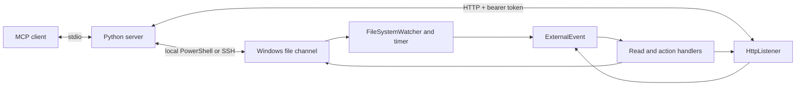

# Architecture

## Components

The [Python server](../server/revit_model_mcp/server.py) registers read tools and optional action tools, then constructs jobs.
[RevitReadChannel](../server/revit_model_mcp/revit_channel.py) serializes calls with an asyncio lock.
The [HTTP host](../server/revit_model_mcp/http_host.py) submits jobs and polls results by ID.
The [PowerShell host](../server/revit_model_mcp/ssh_host.py) publishes jobs and reads responses locally or through SSH.
The [add-in application](../src/RevitModelMcp.Addin/Application.cs) creates the Revit ExternalEvent and heartbeat.
The core project contains parsers, data contracts and serializers without Revit API references.

## File request lifecycle

1. The server checks for a Revit process and records existing responses for the command.
2. It writes JSON to a unique `mcp_<uuid>.tmp` file and moves it to `trigger.txt`.
3. The file watcher requests an ExternalEvent. A 10-second timer provides a fallback check.
4. Revit executes the handler in its API context. The channel matches `targetDocument` and claims the trigger.
5. Readers produce a response. Paged sessions request further ExternalEvent callbacks until complete.
6. The server detects a new `response_<timestamp>_<command>.json` and validates the response.
7. The host removes response and temporary files. View exports also copy and remove the remote PNG.

Jobs contain a `command` and command-specific fields.
Successful responses contain `command`, `success` and `data`.
Responses also carry timing and responder metadata.
See the [response contracts](../src/RevitModelMcp.Core/Models/ReadCommandModels.cs).
The file protocol has no request correlation identifier.
HTTP assigns a `jobId` and polls `/jobs/{id}`; completed results expire after ten minutes.
The asyncio lock serializes calls within one server process only.
One server process per channel directory avoids competing response consumers.

## Revit context and model access

File watcher and timer callbacks request work through ExternalEvent.
The event handler calls [ControlChannel.Tick](../src/RevitModelMcp.Addin/Control/ControlChannel.cs) in the Revit API context.
The default MCP tools query the model and export images without editing model elements.
Opt-in actions require both the server registration flag and the workstation gate.
See [action behavior](../README.md#actions-opt-in) for transactions, warning resolution and dialog suppression.
Image export uses `Document.ExportImage` with a selected view set.
It does not change the active view.
The channel also accepts legacy snapshot and view dump jobs that are not exposed as MCP tools.
The legacy view dump session can open and close UI views.
File output, logs and optional window activation are observable side effects.

## Instances and heartbeat

Each Revit instance writes `instance_<processId>.json` every five seconds.
The heartbeat contains process ID, Revit version, active document title, path and a UTC timestamp.
The add-in caches document information from Revit events before the timer writes it.
Heartbeat replacement uses a temporary file and `File.Replace` or `File.Move`.
The server ignores malformed heartbeat files and records older than 60 seconds.
When valid heartbeats exist it returns those instances.
Only when none remain does it fall back to process IDs with `pluginResponding=false` and empty document fields.

`document` maps to `targetDocument` in a job.
The matcher checks the active document title and the file name extracted from its path.
Matching is case-insensitive and accepts substrings.
Use a distinctive title or file name to avoid ambiguous matches.
Without a target any matching Revit instance can claim the trigger.

## Failure behavior

A pre-existing trigger produces a busy error.
A pickup timeout leaves the pending trigger in place.
The job can execute after the caller receives that timeout.
A response timeout means pickup occurred but no new response was found within the response budget.
Network polling retries transient SSH and command timeout failures.
Read-command failures become MCP tool errors.
Action failures returned by the executor preserve their response object, including `error` and available action metadata.
Transport failures become MCP tool errors for both reads and actions.
Model data and add-in error messages retain their source language.

See the [feed format](feed-format.md) for field names and directories and [known gaps](roadmap.md#known-gaps) for protocol limitations.
