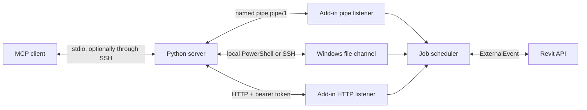

# Transport

`REVIT_MCP_HOST` selects `local`, `ssh:<alias>`, `http://host:port` or `https://host:port`.
`--host` overrides it.
`local`, the default, talks to the add-in over a per-process named pipe and falls back to the file channel.
For a remote client, run the whole server on the workstation over SSH stdio; see [remote setups](#remote-setups).
HTTP connects directly to the add-in and requires no SSH server or remote file transfer.
The MCP client still communicates with the Python server over stdio.

## Named pipe

Each add-in listens on `\\.\pipe\RevitModelMcp.<pid>` from startup.
The pipe needs no port, URL reservation or settings, and it coexists with other MCP servers in the same Revit.
Its ACL admits only the Windows user running Revit, and the add-in drops clients that connect from another computer.
The heartbeat advertises `pipe/1` only after the pipe listens.

`REVIT_MCP_HOST=local` reads the heartbeats in the channel directory directly.
It uses the pipe when the selected instance lists `pipe/1` in `protocols`.
Otherwise, or when the pipe cannot be opened, it uses the local file channel.
Instance selection follows the file channel rules below.
The server keeps one connection per Revit process and checks that `hello` returns the heartbeat's `pid` and `instanceId`.

### Protocol pipe/1

Messages are UTF-8 JSON objects, one per line.
Requests are limited to 1 MiB; a longer line gets a `message_rejected` error and closes the connection.
Replies carry command results and have no size limit.
A request may carry `id`; its reply echoes it.
`hello` must come first on every connection.

| Request | Reply |
| --- | --- |
| `{"type":"hello","protocol":"pipe/1","clientId":"…","clientName":"…"}` | `{"type":"hello","instanceId","pid","revitVersion","documents"}` |
| `{"type":"submit","job":{…}}` | `{"type":"submitted","jobId","state","position"}` |
| `{"type":"status","jobId":"…"}` | `{"type":"status","jobId","state","position","result"}`; `result` only when finished |
| `{"type":"cancel","jobId":"…"}` | `{"type":"cancel","jobId","cancelled","state","message"}` |

`job` is the same JSON object as a file job, and its `clientId` must equal the `hello` client ID.
For every job it submitted, a connection receives `{"type":"job","jobId","state","position"}` when the state changes.
It then receives one final `{"type":"job","jobId","state","result"}` with `state` `done`, `failed` or `cancelled` and the command response in `result`.
Failures return `{"type":"error","id","error","message"}`.
Codes include `hello_required`, `client_mismatch`, `invalid_job`, `invalid_message`, `duplicate_job_id`, `actions_disabled` and `queue_full` with `retryAfterMs`.

Pipe, HTTP and file jobs share one per-Revit scheduler.
A disconnect cancels that connection's queued jobs; a running job, and above all a running action, always finishes.
A client that reconnects with the same `clientId` can send `status` for its unfinished job to get the result and resume its pushes.
Results expire ten minutes after completion.
`revit_export_view` over the pipe moves the PNG from `ROOT\instances\<pid>\` to `save_to` or a new temporary directory.

## HTTP configuration

HTTP is opt-in and off by default; a default deployment uses only the named pipe and the local file channel.
On first startup the add-in creates `%LOCALAPPDATA%\RevitModelMcp\settings.json`:

```json
{
  "httpEnabled": false,
  "httpBind": "127.0.0.1",
  "httpPort": 53110,
  "token": "<generated 32-byte base64url token>"
}
```

The token is per Windows user and persists across restarts.
Settings and the `read-only` file remain in this default directory even when `REVIT_MCP_CHANNEL_DIR` overrides the file channel.
The add-in creates and restricts the file with a protected NTFS ACL granting full control only to the current Windows user.
Keep the token private and transfer it to the client's secret store through a trusted channel.
The add-in never logs it.
Do not put it in a URL, repository or shared shell history.

Revit environment variables override settings at startup: `REVIT_MCP_HTTP_ENABLED=0|1`, `REVIT_MCP_HTTP_BIND`, `REVIT_MCP_HTTP_PORT` and `REVIT_MCP_TOKEN`.
Overrides are not written back to the settings file.
Set `httpEnabled=true` in settings or `REVIT_MCP_HTTP_ENABLED=1` before launching Revit to enable HTTP.
Assign each HTTP-enabled Revit process its own `REVIT_MCP_HTTP_PORT`; the settings file is shared by the Windows user.
For example, launch one process from a PowerShell session with `$env:REVIT_MCP_HTTP_ENABLED = '1'` and `$env:REVIT_MCP_HTTP_PORT = '53111'`, and another with port `53112`.
Each port requires its own URL reservation.
Set `httpEnabled=false` or `REVIT_MCP_HTTP_ENABLED=0` to turn the listener off entirely.

**Upgrade note:** an existing `settings.json` with `httpEnabled:true` remains enabled after this default change.
The stored value is preserved.
To stop the listener, set it to `false` or set `REVIT_MCP_HTTP_ENABLED=0` before upgrading, then enable HTTP deliberately if wanted.
Restart Revit after changing listener settings.
Invalid settings disable HTTP and leave the file channel available.

### Windows URL reservation

Default script and MSI installs neither register a URL ACL nor require a `netsh` command.
URL reservation is a separate opt-in installation step; it does not change the listener settings.
An elevated script install reserves the selected prefix only with `-EnableHttp`:

```powershell
.\install.ps1 -Year 2026 -EnableHttp -HttpBind 127.0.0.1 -HttpPort 53111
```

For either MSI package, pass `HTTP_ENABLED=1 HTTP_URL_PREFIX="http://127.0.0.1:53111/"` to `msiexec /i <package.msi>`.
The prefix must match the explicitly enabled Revit process.
The single-user MSI retains its per-user installation scope and supports elevation for the optional reservation.
Run the installer as the account that runs Revit; deployment as another account or SYSTEM requires a reservation for the Revit user.
Without elevation, an opted-in script install prints the exact reservation command for an elevated command prompt.
The script preserves existing reservations without claiming ownership.
An opted-in MSI install fails if its prefix already exists; omit `HTTP_ENABLED=1` to use a reservation managed outside that MSI.

Changing `httpPort` or `httpBind` requires a matching URL reservation.
Use `+` in the reservation prefix for `httpBind=0.0.0.0`.
An access-denied warning in the add-in log includes the exact configured prefix and repair command.
The listener remains stopped until the reservation exists and Revit restarts.

MSI uninstall removes only the prefix recorded for that installed product after successful registration.
Major upgrades remove that owned reservation; pass the HTTP installation properties again to reserve a prefix for the new version.
The script records a successfully created prefix under `%APPDATA%\Autodesk\Revit\Addins\RevitModelMcp-http-urlacl.txt`.
`install.ps1 -Uninstall` removes that recorded prefix after the last installed Revit year for the current user, or prints its removal command when not elevated.
Reservations from older installers without an ownership record, and manually managed reservations, require manual removal.

After explicitly enabling HTTP, start Revit with a model open and check from PowerShell:

```powershell
Test-NetConnection 127.0.0.1 -Port 53110
curl.exe -i http://127.0.0.1:53110/health
```

The TCP check reports `TcpTestSucceeded: True`; `/health` returns HTTP 200.

### Client connection

The client reads `REVIT_MCP_TOKEN`; `--token` overrides it.
Prefer the environment populated by a secret store.
With the token already available in the client environment:

```sh
export REVIT_MCP_HOST=http://127.0.0.1:53110
uv run --directory server revit-model-mcp
```

HTTP has no built-in TLS.
Use an SSH tunnel, Tailscale or a TLS reverse proxy; the client validates HTTPS certificates.
Redirects are rejected to prevent forwarding the bearer token to another endpoint.
`/health` is unauthenticated and reveals the Revit version, active document name, process ID, startup identity (`startedUtc`) and read-only state.
All other routes require `Authorization: Bearer <token>`.

| Request | Result |
| --- | --- |
| `GET /health` | `ok`, `revitVersion`, `documentName`, `processId`, `startedUtc`, `readOnly` |
| `POST /jobs?timeout=120` | Enqueue a job; return its state, position and ID |
| `GET /jobs/{id}` | State and position with HTTP 202 while pending; state and result with HTTP 200; HTTP 404 after expiry |
| `POST /jobs/{id}/cancel` | JSON body `{"clientId":"<server GUID>"}` cancels that client's queued job; running actions finish |
| `GET /views/{name}/image?pixel=1600` | PNG bytes from the same view exporter used by `revit_export_view` |

POST waits default to 120 seconds and accept 0-600 seconds.
HTTP 202 contains `jobId`, `state` and `position`; it means the accepted job is still queued or executing.
A timeout or client disconnect does not cancel a job.
Results expire ten minutes after completion.
Do not resubmit an action after a timeout without checking its result and the model.
The Python client submits once with `timeout=0`, then polls within `timeout_seconds`.
`pickup_timeout_seconds` applies only to file transports.

HTTP 401 means the token is missing or invalid.
HTTP 429 with `error:queue_full` means this client already has 16 queued jobs; `retryAfterMs` gives a retry hint.
HTTP 403 rejects action jobs while the workstation `read-only` gate file is present.
MCP action tools are refused with `read-only mode` when `REVIT_MCP_READ_ONLY=1` in the Python process.
HTTP and file jobs share one per-Revit scheduler. The add-in executes one job at a time and rotates between clients.
Jobs are limited to 1 MiB.

View names must be URL-encoded; `pixel` accepts 1-4000.
Image requests can return HTTP 202 with `jobId` after 120 seconds.
Poll `/jobs/{id}`, then append `jobId={id}` to the image URL to fetch that export without executing it again.
The optional `document` query must match the job's `targetDocument`.
The Python exporter follows this path and preserves response metadata and the local PNG path.
HTTP image artifacts fetched this way expire with the result.

Each HTTP endpoint belongs to one Revit process.
The server checks PID and `startedUtc` through `/health` before submission and uses only the configured endpoint; it does not scan ports.
The heartbeat advertises `httpPort` only after the listener binds successfully; disabled or failed listeners advertise null.
For several instances, configure a distinct port in each process environment before launch.
An occupied port disables HTTP for the later instance and produces a log message; its file channel remains available.
`revit_list_instances` reports the connected endpoint in HTTP mode.
`targetDocument` and `targetProcessId` are checked in the Revit API context before execution.

## Remote setups

The recommended remote setup runs the whole server on the workstation and carries MCP stdio through SSH.
For a corporate PC without administrator rights and without sshd, use option 2 with IT-provisioned Tailscale.
Never expose the endpoint on the office LAN.
If neither service is available, IT must provision a route first; this add-in cannot bypass that requirement.

### Recommended: server over SSH stdio

Install the server once on the Windows workstation, under the account that runs Revit:

```powershell
uv tool install revit-model-mcp
```

Register the client with `ssh` as the command, replacing `revit-pc` with the host alias from the client's SSH configuration:

```json
{
  "mcpServers": {
    "revit-model-mcp": {
      "command": "ssh",
      "args": ["revit-pc", "revit-model-mcp", "--redact-paths"]
    }
  }
}
```

The remote server runs with its default `REVIT_MCP_HOST=local`, so it reaches Revit through the named pipe.
MCP messages flow through the SSH session; no PowerShell process starts per job and no port opens.
Set other server variables in the workstation user's environment, because the client's `env` block does not cross SSH.
The SSH account must be the Windows user running Revit: the pipe ACL admits only that user.
Key-based authentication avoids a password prompt that would block stdio.

`ssh:<alias>` in option 4 remains the fallback when the server cannot run on the workstation.

### 1. Same LAN

Use this only on a trusted network where the workstation owner permits direct access.
Set `httpBind` to `0.0.0.0` explicitly, or set `REVIT_MCP_HTTP_BIND=0.0.0.0` before starting Revit.
Run once in an elevated Windows command prompt, replacing `<user>` with the account running Revit, such as `DOMAIN\name`:

```bat
netsh http add urlacl url=http://+:53110/ user=<user>
netsh advfirewall firewall add rule name="Revit Model MCP" dir=in action=allow protocol=TCP localport=53110
```

On the Mac at the clone root, replace `revit-host` with the workstation hostname and supply `REVIT_MCP_TOKEN` through the secret store:

```sh
export REVIT_MCP_HOST=http://revit-host:53110
uv run --directory server revit-model-mcp
```

The bearer token and model data are plaintext on this route.
Prefer a tunnel whenever possible.
The listener logs the required URL reservation command on access denied.
Windows may also require an explicit loopback reservation under a restricted account.
For a specific bind address, use that address in the URL ACL instead of `+`.
See [Microsoft HttpListener prefix guidance](https://learn.microsoft.com/en-us/dotnet/api/system.net.httplistener?view=netframework-4.8.1).

### 2. Different networks: Tailscale

Install Tailscale on both machines and join the same permitted tailnet.
Windows installation requires local administrator access once; IT must also provision the URL ACL and any required firewall permission for the Tailscale interface.
Routine use then runs under the Revit user's account.
Bind to the workstation's Tailscale IPv4 address instead of `0.0.0.0` when possible.
Use that same address in the URL ACL and restrict firewall access to the permitted Tailscale peer.
See [Tailscale installation for Windows](https://tailscale.com/docs/install/windows).

```sh
export REVIT_MCP_HOST=http://100.101.102.103:53110
uv run --directory server revit-model-mcp
```

For a Mac without administrator rights, standalone `tailscaled` and `tailscale` binaries can run in userspace mode with an HTTP proxy and user-owned state.
With those binaries available in PATH:

```sh
mkdir -p "$HOME/.local/state/tailscale-revit"
tailscaled --tun=userspace-networking \
  --state="$HOME/.local/state/tailscale-revit/state" \
  --socket="$HOME/.local/state/tailscale-revit/socket" \
  --outbound-http-proxy-listen=127.0.0.1:1055
```

In another terminal:

```sh
tailscale --socket="$HOME/.local/state/tailscale-revit/socket" up
export http_proxy=http://127.0.0.1:1055
export https_proxy=http://127.0.0.1:1055
export REVIT_MCP_HOST=http://100.101.102.103:53110
uv run --directory server revit-model-mcp
```

The Python HTTP transport honors these standard proxy environment variables.
Userspace mode does not create a system VPN interface; the proxy supplies the route.
See [Tailscale userspace networking](https://tailscale.com/docs/concepts/userspace-networking).

### 3. Existing SSH: loopback port forward

This option keeps the workstation listener on `127.0.0.1` and is the safest setup when sshd is already available.
It opens no new office-LAN port.

```sh
ssh -N -L 53110:127.0.0.1:53110 user@host
```

In another terminal, with the bearer token in the environment:

```sh
export REVIT_MCP_HOST=http://127.0.0.1:53110
uv run --directory server revit-model-mcp
```

### 4. SSH file channel

The existing transport remains available without HTTP:

```sh
export REVIT_MCP_HOST=ssh:revit-host
uv run --directory server revit-model-mcp
```

The file channel needs no HTTP opt-in or URL reservation.

## File channel

The default directory is `%LOCALAPPDATA%\RevitModelMcp` on the Windows account running Revit.
Set `REVIT_MCP_CHANNEL_DIR` to an absolute Windows path to override it.
The server and Revit must use the same directory.
The Revit environment must contain the override before Revit starts.

Discovery reads `ROOT\instance_<pid>.json` only, where `ROOT` is the configured directory.
Each v2 add-in owns `ROOT\instances\<pid>\`:

| Location | Role |
| --- | --- |
| `ROOT\instance_<pid>.json` | Shared discovery heartbeat |
| `ROOT\instances\<pid>\mcp_<uuid>.tmp` | Job before atomic publication |
| `ROOT\instances\<pid>\job_<jobId>.json` | Published job awaiting pickup; legacy `trigger.txt` is also accepted |
| `ROOT\instances\<pid>\response_<timestamp>_<command>_<correlationId>.json` | Atomic correlated response |
| `ROOT\instances\<pid>\view_*.png` | Exported view before download |
| `ROOT\instances\<pid>\latest.json`, `latest.txt`, `snapshot_*.json`, `views_dump_*` | Legacy snapshot and view-dump output in the same instance directory |

Response temporary files also remain in the selected instance directory.
On startup the add-in moves any previous `trigger.txt` to a uniquely named `stale_*.tmp` before starting its watcher.
It does not execute that pending job after PID reuse or watch a trigger in ROOT.

The server resolves a target before publishing any job.
Actions and undirected reads require exactly one running Revit process.
Directed reads require exactly one active document matching the case-insensitive title or file-name substring.
Zero or multiple matches fail before publication.
Actions retain their open-document resolution inside the selected process.
After pickup, a directed read rechecks the active document and returns a correlated error if it changed to a non-matching model.

A fresh heartbeat and an existing process are pre-checks.
For v2 the server performs a bounded ping handshake with a fresh `correlationId` in the selected directory.
It checks the response correlation, `responder.processId` and unchanged heartbeat `startedUtc` before submitting the requested job.
The handshake has a 60-second budget, including the SSH connection limiter.
`pluginResponding=true` for v2 means this handshake succeeded.
Timed-out instances remain in discovery with `pluginResponding=false`.
Processes without a fresh heartbeat remain visible with empty document fields when no document filter is supplied.
The server rejects execution on an unconfirmed channel.

The selected PID, startup identity and directory remain fixed through polling, JSON/PNG reads and cleanup.
Publication checks that the selected process still exists and that its v2 heartbeat identity is current.
Atomic publication does not overwrite another job file.
Cleanup affects only the selected directory and the current job's files.
Two MCP clients targeting the same PID enqueue independently. Each server process supplies its own `clientId`.
Reading inactive documents remains outside this protocol. Queued actions can be cancelled; running actions finish.

### Discovery heartbeat

The add-in rewrites `ROOT\instance_<pid>.json` atomically every five seconds.
Discovery version 3 keeps the v2 fields and adds the pipe and the open documents:

| Field | Meaning |
| --- | --- |
| `processId`, `revitVersion`, `startedUtc`, `updatedUtc` | Process identity and heartbeat time |
| `documentTitle`, `documentPath` | Active document, empty when none is active |
| `fileChannelVersion` | `2` |
| `httpPort` | Bound HTTP port, or null |
| `discoveryVersion` | `3` |
| `instanceId` | GUID generated once per Revit process lifetime |
| `pipeName` | `RevitModelMcp.<pid>`; absent when the pipe failed to start |
| `protocols` | `pipe/1` when listening, always `file/2`, and `http/1` when HTTP is bound |
| `documents` | Every open non-linked document: `title`, `path`, `isActive`, `isFamilyDocument` |

`revit_list_instances` returns these fields in local pipe mode; path redaction also covers `documents[].path`.

### File protocol compatibility

Update the server **before** updating the add-in.
A heartbeat without `fileChannelVersion` selects the legacy shared ROOT layout only when exactly one Revit process is running.
The legacy heartbeat indicates presence only; it does not prove a v2 handshake or resolve the old shared-trigger race.
A v2 add-in remains discoverable by old servers, but their ROOT file commands are incompatible.
Unknown protocol versions are rejected explicitly before publication.
Mixed installations allow directed reads to a uniquely matched v2 instance; legacy execution remains restricted to a single process.

The file transport operates independently of the optional HTTP listener.
Revit API work runs through ExternalEvent.
Pending files remain on disk if the server stops.
There is no automatic cancellation of a published job.
The channel relies on Windows file permissions.

## Local host

`REVIT_MCP_HOST=local` is the default.
The server reads heartbeats from the channel directory and prefers the [named pipe](#named-pipe).
For add-ins without `pipe/1`, it invokes `powershell.exe -NoProfile -NonInteractive -EncodedCommand` on Windows.
That process checks Revit, publishes jobs and reads responses under the current Windows account.
Local mode requires a running Revit instance with the add-in loaded, and PowerShell for the file channel.
macOS and Linux clients run the server on Windows over SSH stdio, or use HTTP or `ssh:<alias>`.

## SSH host

`REVIT_MCP_HOST=ssh:<alias>` selects a host in the client's SSH configuration.
`--host ssh:<alias>` provides the same setting on the command line.
The client invokes `ssh` with batch mode and a 45-second connection timeout.
The remote command runs Windows PowerShell with a UTF-16LE base64-encoded script.
Host aliases are validated and PowerShell path literals escape single quotes.
SSH credentials and routing belong to the user's SSH configuration.

Responses and exported PNG files are transferred as base64 in the PowerShell result.
The server decodes the image into `save_to` or a new temporary directory.
An existing destination file produces an error.
The MCP result contains the image path and metadata without base64.

Each SSH invocation includes `-o ControlMaster=auto -o ControlPath=<dir>/mux-%C -o ControlPersist=600` by default.
Commands for the same connection reuse the master instead of opening a new TCP connection for each PowerShell call.
The master persists for 600 idle seconds.
`<dir>` is `$XDG_RUNTIME_DIR` when nonempty, otherwise `/tmp/revit-model-mcp-<uid>/`.
The directory is created or restricted to mode `0700` on macOS and Linux.
Keep the directory path short; `%C` provides a hashed connection identifier within the Unix socket path limit.

`REVIT_MCP_SSH_MUX=0` disables these built-in multiplexing options.
Use it on clients without multiplexing support, such as native Windows OpenSSH.
`REVIT_MCP_SSH_OPTIONS` appends shell-quoted arguments after built-in options and before the host, for example `-o ServerAliveInterval=30 -p 2222`.
OpenSSH uses the first value for an option.
A custom socket path or lifetime requires `REVIT_MCP_SSH_MUX=0` plus all three `Control*` options in `REVIT_MCP_SSH_OPTIONS`.
Local mode ignores both variables and creates no multiplexing directory.

SSH command starts retain a limit of five per rolling 30 seconds within one host object.
Polling waits ten seconds between attempts.
Job preparation and final response retrieval each use one command.
Transient failures during polling can be retried within the remaining timeout.
Local mode uses the same file operations and polling without the SSH connection limiter.

## Optional activation

Set `REVIT_MCP_ACTIVATE_TASK` to the name of an existing Windows scheduled task that activates Revit.
After 60 seconds without pickup the next check can invoke that task once.
Activation only occurs if the current job file still exists.
The server checks the task result and reports activation failure separately.
The task is optional and is never created by the server.
The default pickup timeout is 300 seconds, followed by a separate 120-second response timeout.

## Path redaction

`REVIT_MCP_REDACT_PATHS=1` or `--redact-paths` strips directories from response `documentPath` and all nested `path` fields, including RVT/CAD/image link paths.
This applies to responder metadata and instance listings.
Image `localPath` remains available to the MCP client.
The option does not sanitize channel files or arbitrary strings in model data and errors.
See [server configuration](../server/README.md#configuration).

## Client registration

For a remote workstation, register the [server over SSH stdio](#recommended-server-over-ssh-stdio).
With the loopback SSH tunnel above running, register the HTTP endpoint from the clone root:

```sh
claude mcp add revit-model-mcp -e REVIT_MCP_HOST=http://127.0.0.1:53110 -e REVIT_MCP_REDACT_PATHS=1 -- uv run --directory "$PWD/server" revit-model-mcp
```

The server process must inherit `REVIT_MCP_TOKEN` from the client's environment or secret configuration.
For the SSH file channel, use `-e REVIT_MCP_HOST=ssh:revit-host` instead; no HTTP token is needed.

## Request architecture



The server submits jobs over the named pipe or HTTP, or writes them to the Windows file channel.
All three feed one scheduler; the add-in runs one job at a time through ExternalEvent.
The pipe and HTTP return JSON directly; the file channel keeps its file-based responses.
A heartbeat identifies each Revit instance, its open documents and its protocols.
The default tools read model data and export images.
Opt-in actions use the same channel and execute in the Revit API context.
See [how it works](how-it-works.md), [architecture](architecture.md) and the [feed format](feed-format.md).

## Installation from a clone

The add-in requires Windows and Revit 2022-2027.
Build with the .NET SDK selected by [`global.json`](../global.json).
The server requires Python 3.11 or later, [uv](https://docs.astral.sh/uv/getting-started/installation/) and an MCP client.
Clone on each machine that will build or run a component:

```sh
git clone https://github.com/sharafutdinovdi/revit-model-mcp.git
cd revit-model-mcp
```

The commands below start from the repository root.
For a downloaded script, use `Unblock-File .\install.ps1` to remove its downloaded-file block or `Set-ExecutionPolicy -Scope Process Bypass` for the current PowerShell session.
On Windows, close Revit and build and install for Revit 2026:

```powershell
.\install.ps1 -Year 2026 -Source Build
```

Or install the latest GitHub release for every detected Revit year (2022-2027):

```powershell
.\install.ps1 -Source Release
```

The inline build, copy and manifest-patching commands live in [`install.ps1`](../install.ps1).
Installation uses `RevitModelMcp\` and `RevitModelMcp.addin` under `%APPDATA%\Autodesk\Revit\Addins\<year>`.
Use `-Year 2024,2026` to select years and `-Version 0.2.0` to pin a release.
`-Source Release` requires a release with an asset for each requested year: v0.1.0 ships R22–R26; v0.2.0 adds R27.
Add `-SignThumbprint <thumbprint>` to sign installed DLLs with a local code-signing certificate on workstations where Revit shows the unsigned add-in dialog on every rebuild.
Add `-RegisterClaude` to register the local server with Claude Code; both `claude` and `uv` must be on PATH.
Use `-Uninstall -Year 2026` to remove that year's add-in; local settings remain intact.
The script refuses to run while Revit is open unless `-Force` is supplied.
Start Revit and open a model after installation, or restart it if it was already running.
The add-in creates `%LOCALAPPDATA%\RevitModelMcp\instance_<processId>.json` and updates it every five seconds.
It adds no ribbon tab or button.
