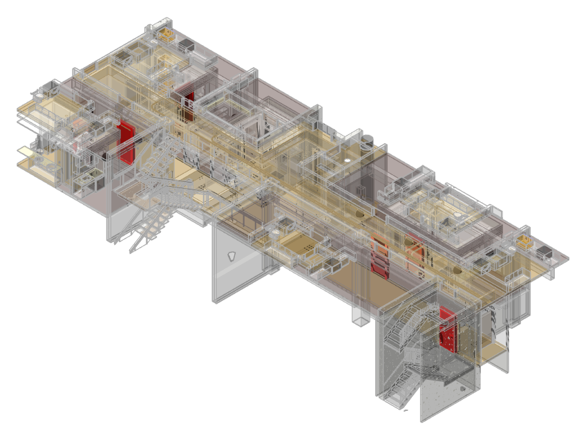
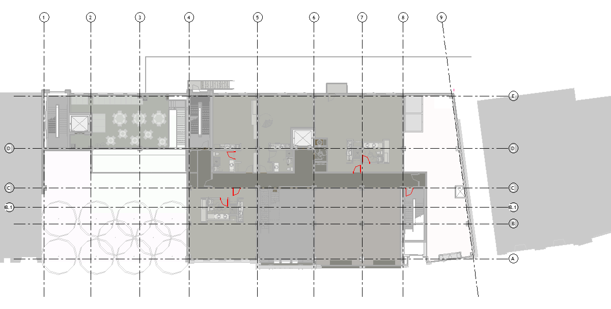
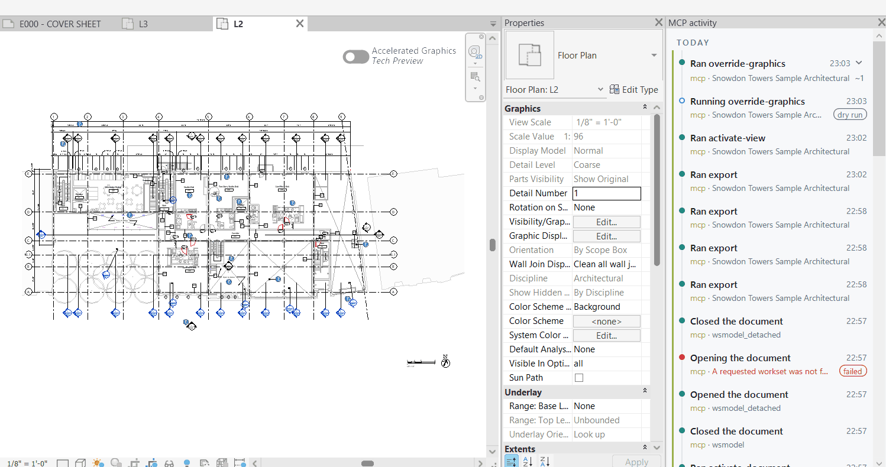
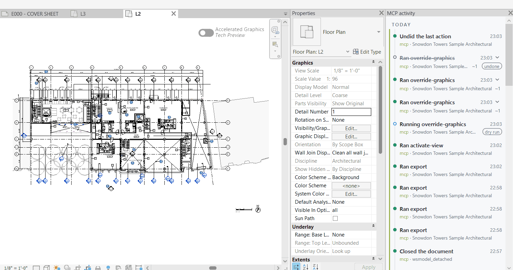

# Validation evidence

Validation status as of 2026-10-01; ✅ denotes a completed check and - denotes no validation evidence for that check.
CI evidence includes the v0.1.0 release builds for R22-R26 and the R22/R26/R27 CI builds.
Local build evidence includes `Release.R26` and `Release.R27`, plus the Revit 2024 build through `install.ps1 -Source Build`.

| Revit year | Build in CI | Local build | Live reads | Live actions | Install script |
| --- | --- | --- | --- | --- | --- |
| 2022 | ✅ | - | - | - | - |
| 2023 | ✅ | - | - | - | - |
| 2024 | ✅ | ✅ | - | - | ✅ |
| 2025 | ✅ | - | - | - | - |
| 2026 | ✅ | ✅ | ✅ | ✅ | ✅ |
| 2027 | ✅ | ✅ | - | - | - |

Live checks use Revit 2026.5 build 26.5.0.55.
The September check used Autodesk's `Snowdon Towers Sample Architectural.rvt`, called from macOS over the SSH transport.
All 18 read tools, including the four coordinator tools, are live-validated.
Live action checks cover `select`, `show`, `isolate`, `move`, `create_wall`, `set_parameter`, `delete` and `batch`, with dry runs and real writes for actions that support them.
Installer checks cover `-Source Build` for 2024 and 2026 with `-SignThumbprint`, `-Source Release` for 2024 from v0.1.0, and `-Uninstall`.
Revit 2022 could not be live-validated in the October pass.
Screenshots and JSON evidence are on the [`validation-assets` branch](https://github.com/sharafutdinovdi/revit-model-mcp/tree/validation-assets).
The Revit undo menu label for a batch (`revit_batch`) cannot be verified through the API.

## Revit 2026 live validation

The October validation covered add-in builds `2db6698` through `7778d0c` on Revit 2026 build 26.5.0.55.
The consolidated record is tracked in [issue #23](https://github.com/sharafutdinovdi/revit-model-mcp/issues/23).

| Tool family | Result | Add-in build | Date |
| --- | --- | --- | --- |
| Interactive reads | Passed | `2db6698` | 2026-10-01 |
| Model snapshot and prompts | Passed | `2db6698` | 2026-10-01 |
| Safe actions | Passed | `2db6698` | 2026-10-01 |
| Batch collection | 11 completed; 2 stopped at error-severity dialogs that required a modifying answer | `7778d0c` | 2026-10-01 |
| Cancellation, worker crash recovery and running-instance isolation | Passed | `7778d0c` | 2026-10-01 |
| Report workbook and Changes sheet | Passed | `7778d0c` | 2026-10-01 |

### Batch collection

All source files remained unchanged.
Files saved in Revit 2022 through 2024 were opened in Revit 2026 and upgraded only in memory.

| Model | Size (MB) | Saved year | Result | Open (seconds) |
| --- | ---: | ---: | --- | ---: |
| M1 | 194 | 2022 | Completed | 1113 |
| M2 | 265 | 2022 | Failed at open: modifying answer required | - |
| M3 | 201 | 2022 | Completed | 727 |
| M4 | 155 | 2022 | Completed | 1055 |
| M5 | 155 | 2022 | Completed | 1050 |
| M6 | 206 | 2022 | Completed | 986 |
| M7 | 213 | 2022 | Completed | 987 |
| M8 | 50 | 2023 | Completed | 68.5 |
| M9 | 31 | 2024 | Completed | 54 |
| M10 | 20 | 2023 | Completed | 62 |
| M11 | 314 | 2022 | Failed at open: modifying answer required | - |
| M12 | 169 | 2022 | Completed | 1565 |
| M13 | 180 | 2022 | Completed | 1342 |

The worker peaked at about 7 GB of memory.
Completed 150-315 MB models opened in 12-26 minutes.
Error-severity dialogs stopped collection where the available continuation required `Disconnect` or `Delete`.
The unsigned add-in prompt must be accepted once per Revit year, followed by a normal Revit close to persist the choice.

## Batch checks

Core policy tests cover state transitions, cancellation and resume, year routing, deadlines, dialog decisions, and the read-only allowlist. Python boundary tests cover input validation, durable state visibility, selected PID, scheduled-task fallback, cancellation, fetch copy, and collisions. Windows CI restores the supervisor with a lock file and checks representative add-in builds, staged artifacts, and MSI contents for the supervisor executable and absence of Autodesk binaries. Live Revit scenarios remain tracked in issue #23; see [batch collection](batch.md).

## v0.9.0 live validation

I ran the published v0.9.0 release artifacts against Revit 2022 to 2027 on a Windows workstation.
The server was `revit-model-mcp==0.9.0` from PyPI, called from macOS over the SSH transport.
The add-in came from the installers attached to the release.
All 11 release assets matched `SHA256SUMS.txt` and carried a valid build provenance attestation.

| Revit year | Build | Started | Result |
| --- | --- | --- | --- |
| 2022 | 22.1.80.32 | ✅ | Reads, action with undo, capture |
| 2023 | not recorded | ✅ | Reads, action with undo, capture |
| 2024 | 24.3.40.26 | ✅ | Reads, action with undo, capture |
| 2025 | not recorded | ✅ | Reads, action with undo, capture |
| 2026 | 26.5.0.55 | ✅ | Everything below |
| 2027 | 27.3.0.28 | ✅ | Reads, action with undo, capture, NWC export |

The installers reported version 0.9.0.0 for all six years.
Revit 2023 and 2025 were started in a second pass, with the per-user and the per-machine installer.
The main model was Autodesk's Snowdon Towers sample, plus its Electrical, Facades, HVAC and Plumbing copies for multi-model runs.

### Results

| Area | Result |
| --- | --- |
| Element capture (`revit_capture_elements`) | Passed in 3D and plan mode. Targets are red, everything else is halftone. The document stayed unmodified and Undo stayed disabled |
| Issue register (`revit_issue_register`) | Passed. The workbook has Cover, Summary with a chart, Register with embedded snapshots and Elements. An invalid element ID became a warning, not a failure |
| Read-only mode | Capture and register work. All 43 action tools are refused by the server. 38 of them were also checked against the add-in gate file and refused there |
| Background jobs | An IFC run over four models returned a `jobId` after 40 seconds and polled to the final result. The result matched the files on disk byte for byte and was identical after a server restart |
| Job cancellation | Cancelling during the second model stopped the run with two models done and two IFC files written |
| Session control | Switching documents both ways kept the document count. Ambiguous view names are refused with candidates. Workset patterns, `audit=true` and `revit_new_document` passed |
| Exports | PDF, DWG, IFC and schedule CSV produced non-empty files. NWC export passed on Revit 2026 and 2027 and refused with a clear message on 2023 and 2025, which have no exporter |
| Highlight | Override, `halftone_others`, reset and one undo restored the view |
| Element edits, families, views, sheets, MEP runs, C# code and batch | Every write has a summary and one named undo entry, and `revit_undo_last` reverts it |
| Family placement at rooms | Passed on Revit 2026. Seven families were placed inside rooms and one undo removed them |
| Process models | Dry run, script, `output_dir` save and the in-place confirmation preview passed. A used token is refused |
| Installers | Both installers cleaned up after themselves. Revit 2019 gets no add-in folder from either one |
| Bundle | The `.mcpb` manifest validates, and the packaged server starts and lists all 77 tools |

### Screenshots

Capture in 3D. The six targets are red and the rest of the model is halftone.

Capture in a plan. Only the door leaves and swings are red.

Highlighting a view and the MCP activity pane.

The same view after one undo. The activity pane lists the undone row.

### Bugs found

The validation found these problems. All of them are fixed on `main` and ship in the next release.

| Problem | Fix |
| --- | --- |
| `GET /health` returned HTTP 500 on the HTTP transport, so no tool call worked over it | [#178](https://github.com/sharafutdinovdi/revit-model-mcp/pull/178) |
| `revit_update_parameters` on doors inside model groups and `revit_walls_from_cad` with `join=true` passed the dry run but failed the real run | [#185](https://github.com/sharafutdinovdi/revit-model-mcp/pull/185) |
| Installing both installer scopes together left files that neither product removed | [#183](https://github.com/sharafutdinovdi/revit-model-mcp/pull/183) |
| A failed in-place confirmation gave a misleading message. `revit_execute_code` with a short `response_timeout_s` reported an error while the job ran. The `revit_jobs` limit of 50 seconds was not documented | [#184](https://github.com/sharafutdinovdi/revit-model-mcp/pull/184) |
| Cancelling during the last model reported `success: false` although every model finished. Several smaller response and wording problems | [#180](https://github.com/sharafutdinovdi/revit-model-mcp/pull/180) |

Related hardening from the same cycle is in [#179](https://github.com/sharafutdinovdi/revit-model-mcp/pull/179), [#181](https://github.com/sharafutdinovdi/revit-model-mcp/pull/181), [#182](https://github.com/sharafutdinovdi/revit-model-mcp/pull/182) and [#186](https://github.com/sharafutdinovdi/revit-model-mcp/pull/186).
The HTTP transport was not tested again after the fix.

### Not covered

- Importing the `.mcpb` bundle into Claude Desktop. I checked the manifest and the server start only.
- Revit 2019. The folder on the workstation has no `Revit.exe`.
- The HTTP transport after #178.
